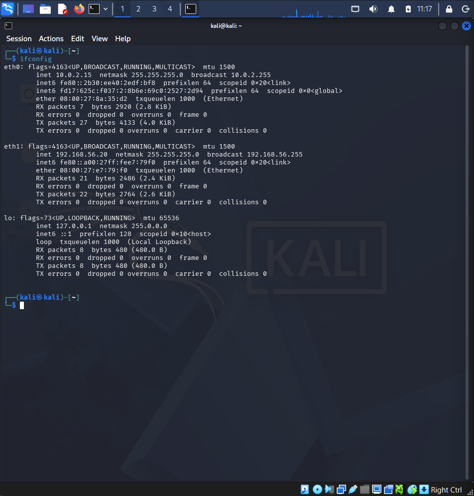
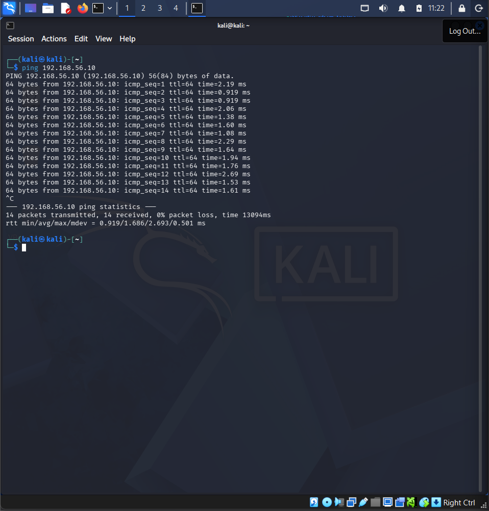
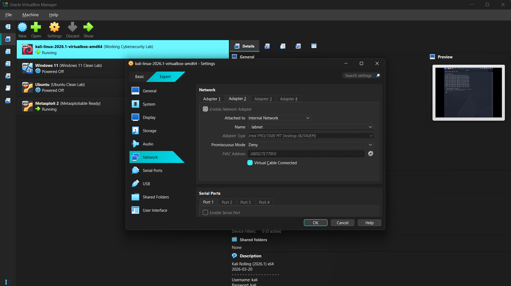
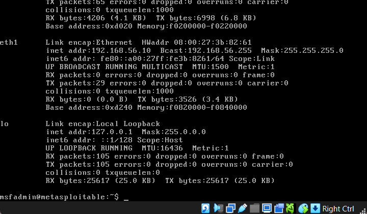
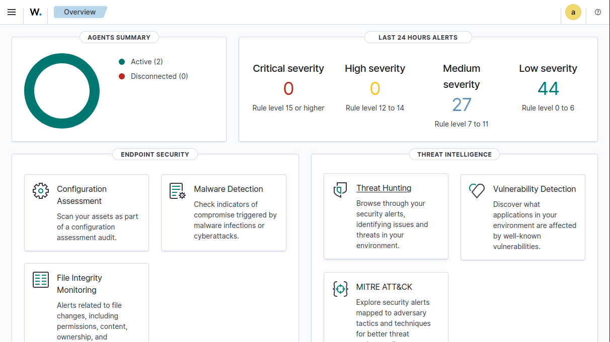
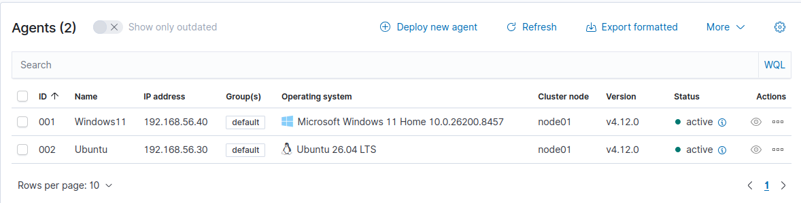
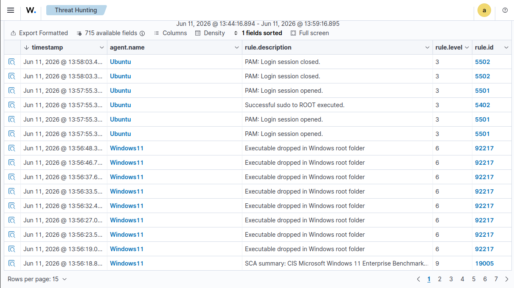
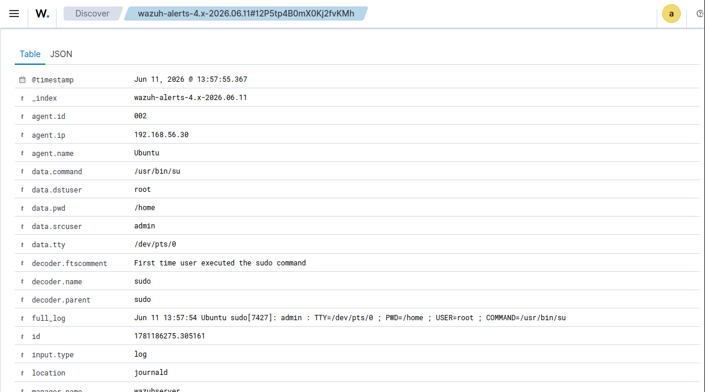

# Cybersecurity Home Lab Setup

## Objective
Built an isolated cybersecurity home lab using VirtualBox for penetration testing, networking practice, packet analysis, and SOC learning.

---

# Lab Environment

| Machine | Role | IP Address |
|----------|------|------------|
| Kali Linux | Attacker Machine | 192.168.56.20 |
| Metasploitable 2 | Vulnerable Target | 192.168.56.10 |
| Ubuntu | Linux Practice Machine | 192.168.56.30 |
| Windows 11 | SOC/Windows Analysis | 192.168.56.40 |

---

# Technologies Used

- VirtualBox
- Kali Linux
- Metasploitable 2
- Ubuntu
- Windows 11
- Internal Networking
- ICMP
- Linux Networking Commands

---

# Network Configuration

All virtual machines were configured using Internal Network mode inside VirtualBox to safely isolate the lab environment from the internet.

---

# Connectivity Verification

Connectivity between machines was verified using ICMP ping tests.

Example:

```bash
ping 192.168.56.10
```

---

# Skills Practiced

- Virtualization
- VM Configuration
- Internal Networking
- Linux Administration
- Basic Troubleshooting
- Network Connectivity Testing

---

# Screenshots# Cybersecurity Home Lab Setup

## Objective

Built an isolated cybersecurity home lab using VirtualBox for penetration testing, networking practice, packet analysis, and SOC learning.

---

# Lab Environment

| Machine | Role | IP Address |
|----------|------|------------|
| Kali Linux | Attacker Machine | 192.168.56.20 |
| Metasploitable 2 | Vulnerable Target | 192.168.56.10 |
| Ubuntu | Linux Practice Machine | 192.168.56.30 |
| Windows 11 | SOC/Windows Analysis | 192.168.56.40 |
| Wazuh Server | SIEM Platform | 192.168.56.50 |

---

# Technologies Used

- VirtualBox
- Kali Linux
- Metasploitable 2
- Ubuntu
- Windows 11
- Wazuh SIEM
- Internal Networking
- ICMP
- Linux Networking Commands
- Endpoint Monitoring
- Threat Hunting

---

# Network Configuration

All virtual machines were configured using Internal Network mode inside VirtualBox to safely isolate the lab environment from the internet.

---

# Connectivity Verification

Connectivity between machines was verified using ICMP ping tests.

Example:

```bash
ping 192.168.56.10
```

---

# Skills Practiced

- Virtualization
- VM Configuration
- Internal Networking
- Linux Administration
- Windows Administration
- Basic Troubleshooting
- Network Connectivity Testing
- Endpoint Monitoring
- Security Event Analysis
- Threat Hunting
- SOC Investigation

---

# Screenshots

## Kali Linux IP Configuration



---

## Successful Ping Test



---

## VirtualBox Internal Network Settings



---

## Metasploitable IP Configuration



---

# Wazuh SIEM Integration

## Objective

Integrated Wazuh SIEM into the cybersecurity home lab to monitor endpoints, collect security logs, perform threat hunting, and investigate security events.

---

## Wazuh Architecture

| Component | IP Address | Role |
|------------|------------|------------|
| Wazuh Server | 192.168.56.50 | SIEM Server |
| Ubuntu Agent | 192.168.56.30 | Linux Endpoint Monitoring |
| Windows 11 Agent | 192.168.56.40 | Windows Endpoint Monitoring |

---

## Features Implemented

- Endpoint Monitoring
- Agent Management
- Security Event Collection
- Threat Hunting
- Log Analysis
- Alert Investigation
- File Integrity Monitoring
- Configuration Assessment

---

## Wazuh Screenshots

### Wazuh SIEM Overview



---

### Active Endpoint Monitoring



---

### Threat Hunting & Event Analysis



---

### Wazuh Alert Investigation



---

## Key Learnings

- Built a centralized SIEM platform using Wazuh
- Connected and monitored Linux and Windows endpoints
- Investigated security alerts and events
- Performed threat hunting using collected logs
- Practiced SOC analyst investigation workflows
- Analyzed authentication and system activity logs
- Gained hands-on experience with endpoint monitoring

---

# Future Improvements

- Add Sysmon monitoring on Windows
- Simulate brute-force attacks from Kali Linux
- Generate and investigate security alerts
- Map alerts to MITRE ATT&CK techniques
- Integrate additional endpoints
- Create incident response playbooks


## Kali Linux IP Configuration


---

## Successful Ping Test


---

## VirtualBox Internal Network Settings


---

## Metasploitable IP Configuration


---

# Future Improvements

- Perform Nmap scanning
- Practice Wireshark packet analysis
- Add vulnerability scanning
- Build SOC investigation projects
- Analyze Linux and Windows logs
