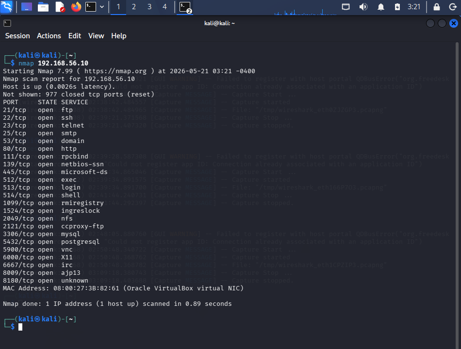
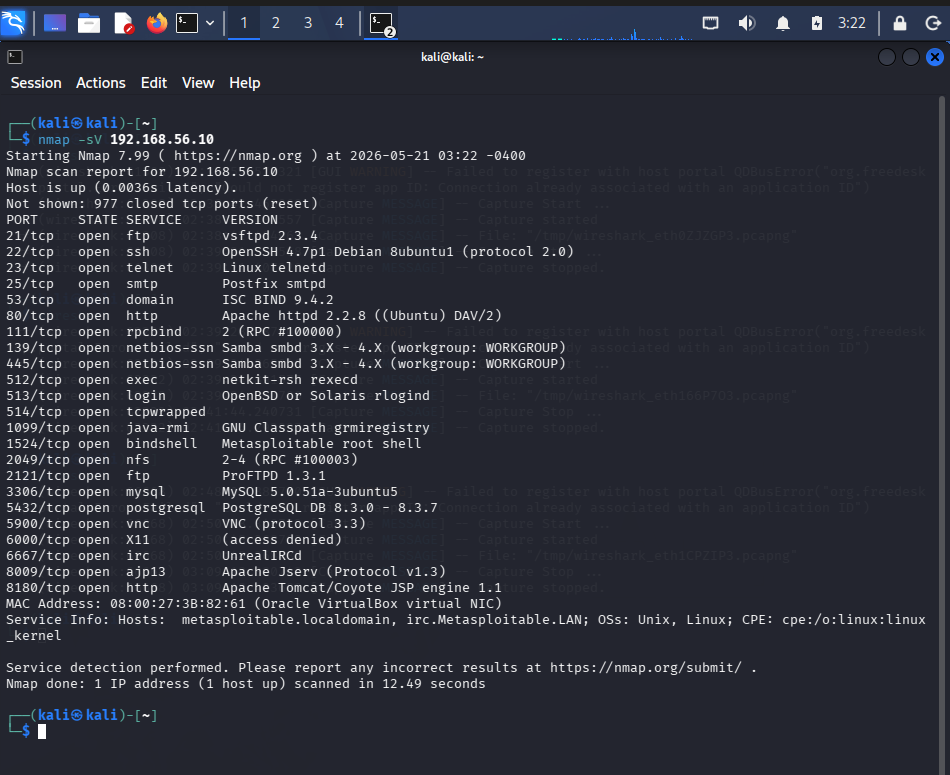
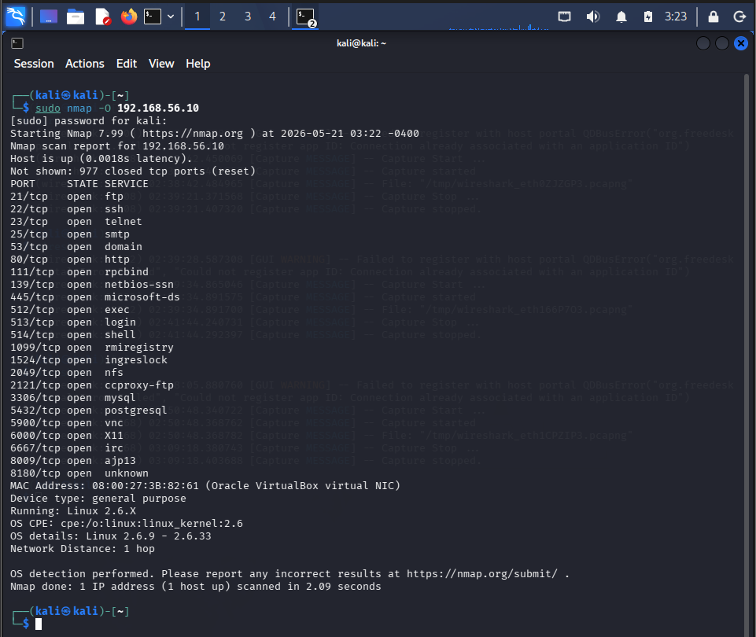

# Network Scanning with Nmap

## Objective

Performed network reconnaissance and service enumeration against the Metasploitable 2 virtual machine using Nmap inside an isolated cybersecurity lab.

---

# Target Information

| Target Machine | IP Address |
|----------------|-----------|
| Metasploitable 2 | 192.168.56.10 |

---

# Tools Used

- Nmap
- Kali Linux
- Metasploitable 2
- VirtualBox Internal Network

---

# Basic Host Discovery Scan

Command Used:

```bash
nmap 192.168.56.10
```

---

# Service Version Detection

Command Used:

```bash
nmap -sV 192.168.56.10
```

---

# OS Detection Scan

Command Used:

```bash
sudo nmap -O 192.168.56.10
```

---

# Skills Practiced

- Network reconnaissance
- Port scanning
- Service enumeration
- OS fingerprinting
- Linux command usage
- Cybersecurity documentation

---

# Screenshots

## Basic Nmap Scan



---

## Service Version Detection



---

## OS Detection Scan


---

# Key Learnings

- Identified open ports on the target machine
- Enumerated running services
- Practiced basic reconnaissance techniques
- Understood how attackers gather information during enumeration
