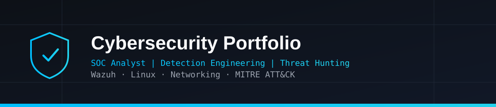

  

---

# 📚 Portfolio Navigation

- 🏠 [Home Lab Setup](Home-Lab-Setup/)
- 🛡️ [SOC Investigations](SOC-Investigations/)
- 🌐 [Network Scanning](Network-Scanning/)
- 📡 [Wireshark Traffic Analysis](Wireshark-Traffic-Analysis/)

---

# 👋 About Me

Hello! I'm **Dinesh Babu**, a Computer Science graduate specializing in Cybersecurity with a strong interest in **Security Operations Center (SOC)** operations, **Threat Hunting**, **Detection Engineering**, and **Incident Response**.

This repository showcases my hands-on cybersecurity learning through a self-built home lab, practical SOC investigations, network analysis, traffic analysis, and custom detection engineering using industry-standard security tools.

My objective is to continuously develop practical blue team skills while documenting every investigation in a structured and reproducible manner.

---

# 📊 Portfolio Statistics

| Category | Count |
|----------|------:|
| Virtual Home Lab | 1 |
| SOC Investigations | 7 |
| Network Scanning Labs | 6 |
| Wireshark Analysis Labs | 8 |
| Custom Detection Rules | 6 |

---

# 🏠 Cybersecurity Home Lab

My cybersecurity home lab is built using **Oracle VirtualBox** and is designed to simulate real-world attack and defense scenarios in an isolated environment. The environment provides a safe, isolated platform for simulating attacks, collecting security telemetry, investigating events, and validating detection rules without affecting production systems.

## Lab Components

| Machine | Role |
|---------|------|
| Kali Linux | Attacker Machine |
| Ubuntu Desktop | Linux Endpoint |
| Windows Server 2022 (DC01) | Active Directory Domain Controller |
| Windows 11 | Domain-Joined Windows Endpoint |
| Wazuh Server | SIEM & Log Management |

## Purpose

- Simulate cyber attacks
- Investigate security events
- Practice Threat Hunting
- Develop custom Wazuh detection rules
- Improve SOC analyst skills

---

# 🛡️ SOC Investigations

| # | Investigation | Platform | Detection |
|---|--------------|----------|-----------|
| 01 | Windows Process Investigation | Windows 11 | Sysmon Process Creation (`whoami /priv`) |
| 02 | SSH Authentication Failure Investigation | Ubuntu Linux | Multiple failed SSH logins followed by successful authentication |
| 03 | Linux Privilege Escalation Investigation | Ubuntu Linux | Successful `sudo` privilege escalation |
| 04 | Linux User Account Creation Investigation | Ubuntu Linux | New local user/group creation via `useradd` (MITRE T1136.001) |
| 05 | Linux Listening Ports Investigation | Ubuntu Linux | Monitoring changes to listening network ports |
| 06 | Nmap SSH Service Detection Investigation | Ubuntu Linux | Custom Wazuh rule detecting Nmap SSH service scans (MITRE T1595, T1046) |
| 07 | Kerberoasting Detection Investigation | Windows Server 2022 (Active Directory) | Custom Wazuh rule detecting RC4-encrypted TGS-REQ (Event ID 4769) for service account SPN (MITRE T1558.003) |

Explore all investigations here:

➡️ **[SOC Investigations](SOC-Investigations/)**

---

# 🌐 Network Scanning

Hands-on network enumeration and reconnaissance using Nmap.

Current topics include:

- Host Discovery
- TCP Connect Scanning
- SYN Scanning
- Service Version Detection
- Operating System Detection
- NSE Vulnerability Scanning

➡️ **[Network Scanning](Network-Scanning/)**

---

# 📡 Wireshark Traffic Analysis

Practical packet analysis covering:

- HTTP
- DNS
- HTTPS/TLS
- DHCP
- SSH
- TCP Three-Way Handshake
- ICMP
- ARP

➡️ **[Wireshark Traffic Analysis](Wireshark-Traffic-Analysis/)**

---

# 🛠️ Technical Skills

## Security

- Security Operations Center (SOC)
- Detection Engineering
- Threat Hunting
- Incident Investigation
- Log Analysis
- MITRE ATT&CK Mapping

## Networking

- TCP/IP
- SSH
- DNS
- HTTP / HTTPS
- ICMP
- ARP
- Network Scanning

## Operating Systems

- Linux
- Windows

---

# 🧰 Tools & Technologies

## SIEM & Security

- Wazuh SIEM
- Sysmon

## Network Analysis

- Wireshark
- Nmap

## Operating Systems

- Kali Linux
- Ubuntu
- Windows 11

## Virtualization & Version Control

- Oracle VirtualBox
- Git
- GitHub

---

# 📈 Learning Roadmap

## ✅ Completed

- Home Lab Setup
- Windows Event Investigation
- Linux Security Monitoring
- Network Scanning
- Wireshark Traffic Analysis
- Detection Engineering & Custom Wazuh Rule Development

## 🔄 Currently Learning

- Reverse Shell Detection
- File Integrity Monitoring (FIM)
- Linux Persistence Detection
- Web Attack Detection
- Advanced Threat Hunting

---

# 📬 Connect With Me

- **GitHub:** https://github.com/Dinesh-kalla
- **LinkedIn:** https://www.linkedin.com/in/dinesh-babu-2866a0275

---

⭐ Thank you for visiting my cybersecurity portfolio!

This repository is continuously updated as I complete new labs, investigations, and detection engineering projects while working toward becoming a SOC Analyst.