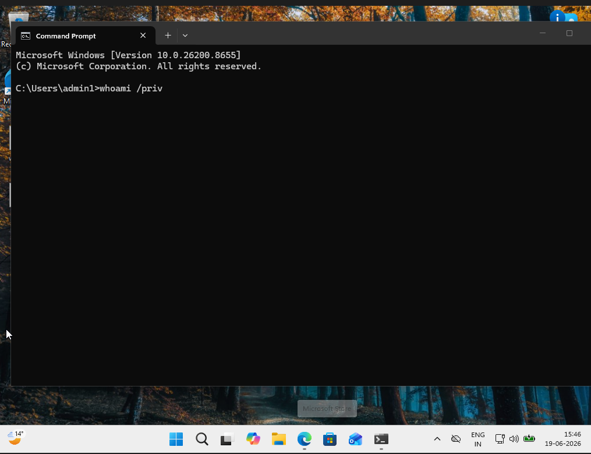
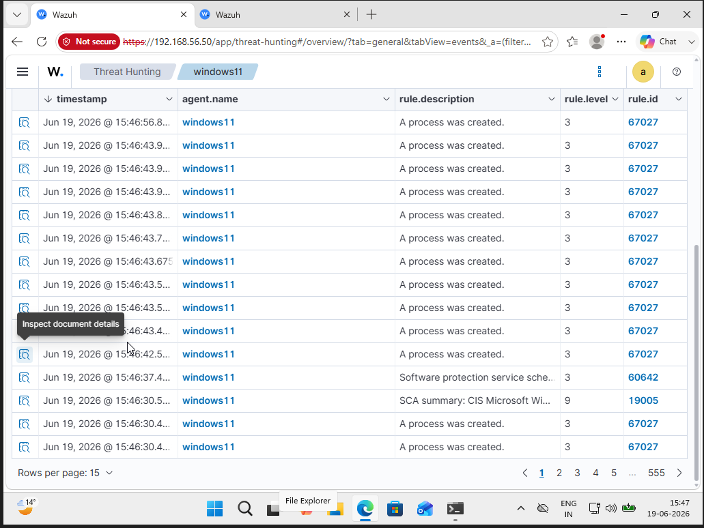
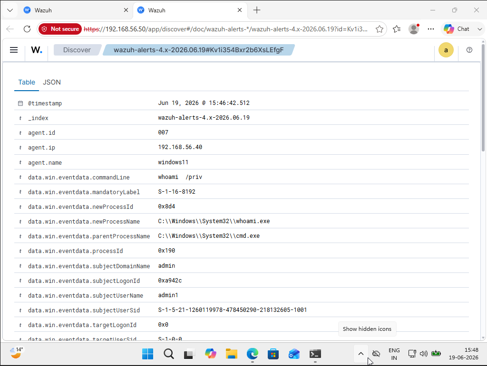
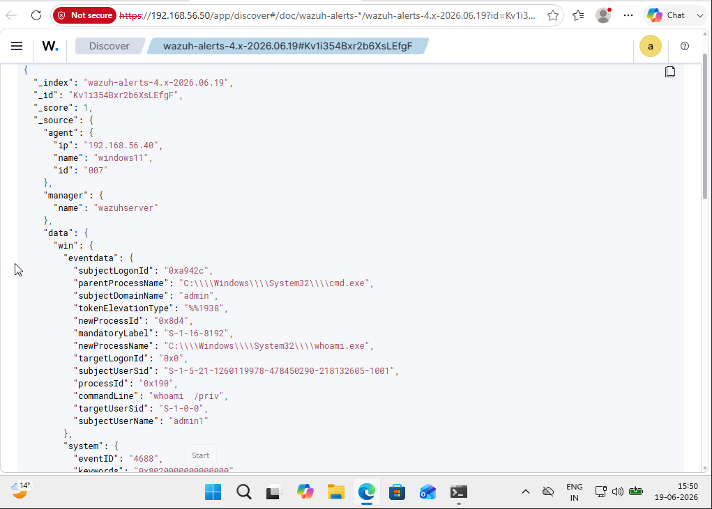

# 🖥️ Windows Process Investigation (whoami /priv)

> **Status:** ✅ Completed

| Field                   | Value                                  |
| ----------------------- | -------------------------------------- |
| **Investigation Type**  | Windows Process Creation Investigation |
| **Platform**            | Windows 11                             |
| **SIEM**                | Wazuh                                  |
| **Endpoint Monitoring** | Sysmon                                 |
| **Detection**           | Process Creation (`whoami.exe`)        |
| **Severity**            | Low (Lab Simulation)                   |

---

## Executive Summary

This investigation documents the execution of the Windows command `whoami /priv`, which was detected through Sysmon Process Creation events and collected by Wazuh SIEM.

The activity was intentionally generated inside a controlled cybersecurity home lab to demonstrate how Windows endpoint telemetry is collected, analyzed, and investigated by a Security Operations Center (SOC).

The investigation focuses on validating the generated alert, reviewing process execution details, analyzing event metadata, and understanding how Windows process monitoring supports threat hunting and incident investigations.

---

## 🎯 Objective

The objective of this investigation was to analyze a Windows process creation event generated by executing the `whoami /priv` command.

During this exercise, Sysmon monitored process execution on the Windows endpoint while the Wazuh agent collected and forwarded the event to the Wazuh SIEM platform.

The investigation focused on validating the generated alert, identifying the executed command, reviewing process metadata, and understanding how Windows process monitoring assists SOC analysts during security investigations.

---

## 🖥️ Lab Environment

| Component                   | Purpose                                          |
| --------------------------- | ------------------------------------------------ |
| Windows 11                  | Endpoint where the command was executed          |
| Sysmon                      | Process creation monitoring and event generation |
| Wazuh Agent                 | Collected Windows event logs                     |
| Wazuh Server                | Centralized SIEM platform                        |
| VirtualBox Internal Network | Isolated environment for safe testing            |

---

## ⚙️ Activity Performed

The following activity was intentionally performed inside the cybersecurity home lab.

### Steps Performed

1. Opened Command Prompt on the Windows endpoint.
2. Executed the following command:

```cmd
whoami /priv
```

3. Sysmon generated a Process Creation (Event ID 1) event.
4. The Wazuh agent collected the generated event.
5. Wazuh indexed the event.
6. The event was investigated using the Wazuh Threat Hunting module.

> **Note:** This activity was performed only for educational purposes inside an isolated cybersecurity home lab.

---

## 🚨 Detection Summary

Wazuh successfully detected the Windows process execution generated by Sysmon.

### Detection Details

| Field            | Value                            |
| ---------------- | -------------------------------- |
| Rule ID          | 67027                            |
| Rule Description | A process was created            |
| Event Source     | Sysmon (Process Creation)        |
| Executable       | `C:\Windows\System32\whoami.exe` |
| Parent Process   | `C:\Windows\System32\cmd.exe`    |
| Command Line     | `whoami /priv`                   |

The generated alert confirms that Sysmon successfully monitored the process execution and Wazuh collected and displayed the event for investigation.

---

## 🔍 Investigation Process

The investigation was performed using the **Wazuh Threat Hunting** module.

The following event attributes were reviewed:

* Timestamp
* Agent Name
* Executing User
* Command Line
* Process Name
* Parent Process
* Process ID
* New Process ID
* Rule ID
* Rule Description
* Event JSON

The investigation confirmed that the command was executed locally from Command Prompt by the logged-in Windows user.

---

## 📷 Evidence

### 1. Command Prompt Execution



---

### 2. Wazuh Threat Hunting Events



---

### 3. Event Details



---

### 4. Event JSON



---

## 🔍 Event Analysis

The investigation identified the following important fields:

| Field          | Observation             |
| -------------- | ----------------------- |
| Agent          | Windows11               |
| Username       | admin1                  |
| Command        | `whoami /priv`          |
| Executable     | `whoami.exe`            |
| Parent Process | `cmd.exe`               |
| Rule ID        | 67027                   |
| Detection      | Process Creation        |
| Log Source     | Sysmon Process Creation |

The collected telemetry confirms that the process execution was successfully monitored by Sysmon and forwarded to Wazuh SIEM for investigation.

---

## 🎯 MITRE ATT&CK Mapping

| Technique                               | Description                                                                                                 |
| --------------------------------------- | ----------------------------------------------------------------------------------------------------------- |
| **T1033 – System Owner/User Discovery** | The `whoami /priv` command can be used to identify the privileges assigned to the currently logged-in user. |

Although this activity was intentionally generated within a controlled lab environment, similar commands are commonly observed during post-compromise reconnaissance and privilege discovery. SOC analysts should review the surrounding context to determine whether the activity is legitimate or suspicious.

---

## 📝 Analyst Assessment

The investigation confirmed that the process execution was intentionally generated inside the cybersecurity home lab.

From a SOC perspective, analysts should verify:

* Whether the process execution is expected.
* Which user executed the command.
* Which parent process launched the executable.
* Whether similar discovery commands were executed.
* Whether additional suspicious activity followed.
* Whether the activity aligns with normal user behavior.

Although this event is benign within the lab, similar process creation events are valuable indicators during endpoint investigations and threat hunting activities.

---

## 💡 Recommendations

* Continuously monitor Windows process creation events.
* Deploy Sysmon across Windows endpoints.
* Investigate unusual command-line activity.
* Review parent-child process relationships.
* Correlate process events with user logon activity.
* Use SIEM threat hunting to identify suspicious endpoint behavior.

---

## 📚 Lessons Learned

* Sysmon provides detailed Windows endpoint telemetry.
* Wazuh successfully collects and parses Sysmon events.
* Process Creation events provide valuable forensic evidence.
* Reviewing command-line arguments improves investigation accuracy.
* Parent process analysis helps validate process execution.
* Event correlation enhances visibility into endpoint activity.

---

## 🛠️ Skills Demonstrated

* Windows Security Monitoring
* Sysmon
* Wazuh SIEM
* Threat Hunting
* Process Creation Analysis
* Windows Event Analysis
* Command-Line Analysis
* Event Correlation
* Endpoint Monitoring
* MITRE ATT&CK Mapping
* SOC Investigation Workflow
* Incident Documentation

---

## ✅ Conclusion

This investigation demonstrated how Sysmon and Wazuh work together to provide visibility into Windows endpoint activity.

By executing the `whoami /priv` command, I gained practical experience collecting Windows process telemetry, validating security alerts, analyzing event metadata, reviewing process relationships, and documenting findings using a structured SOC investigation workflow.

This case study demonstrates my ability to investigate Windows endpoint events using Wazuh SIEM and Sysmon while applying practical SOC Analyst skills in endpoint monitoring, threat hunting, process analysis, and security event investigation.
