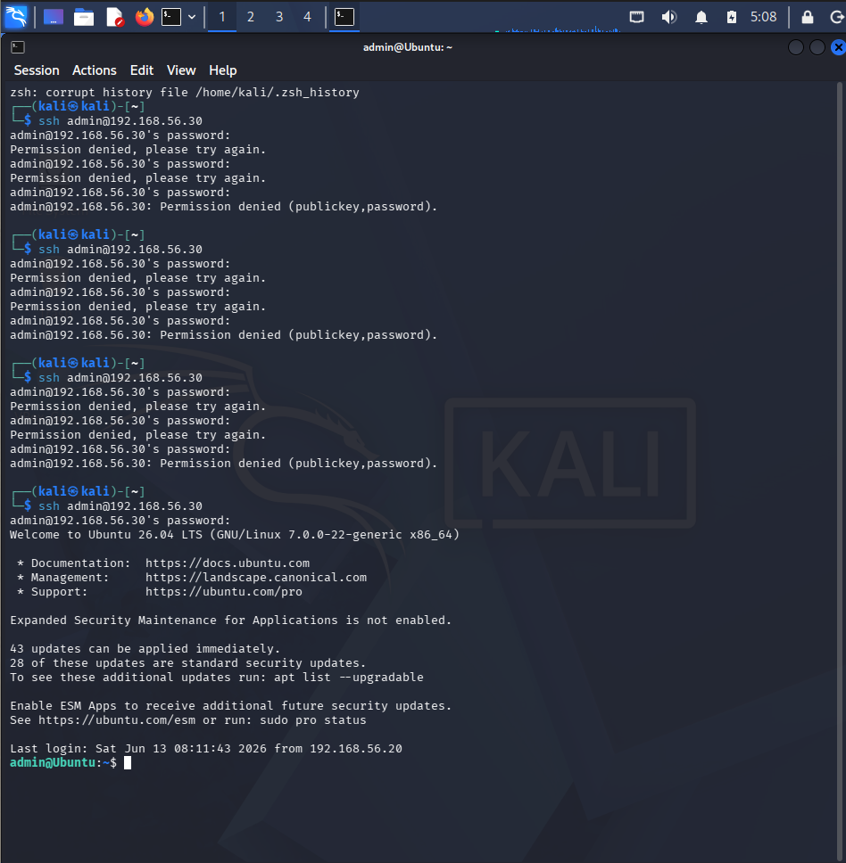
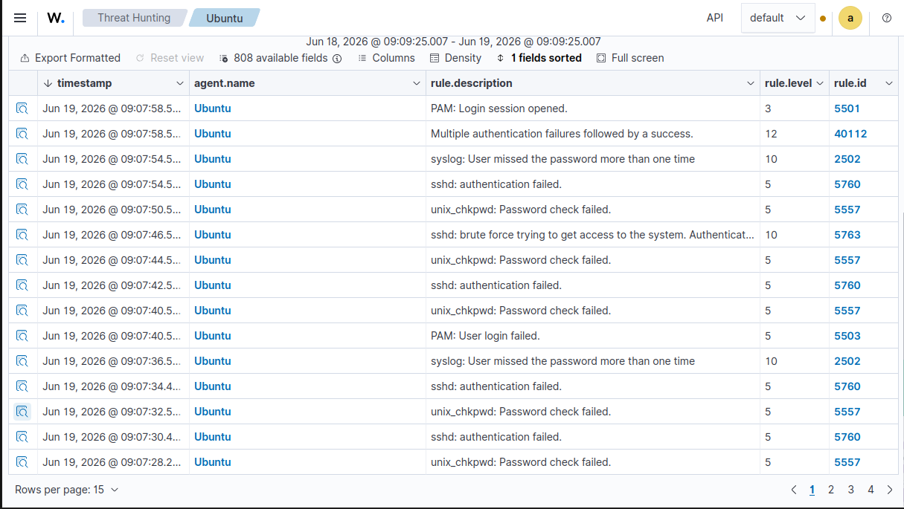
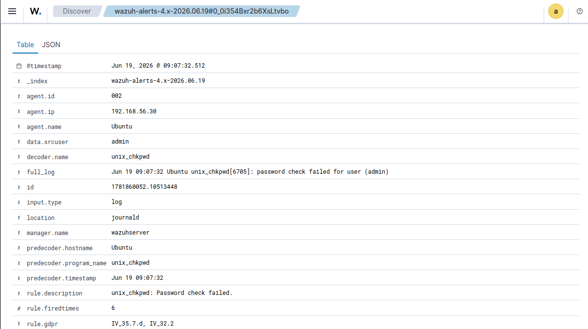
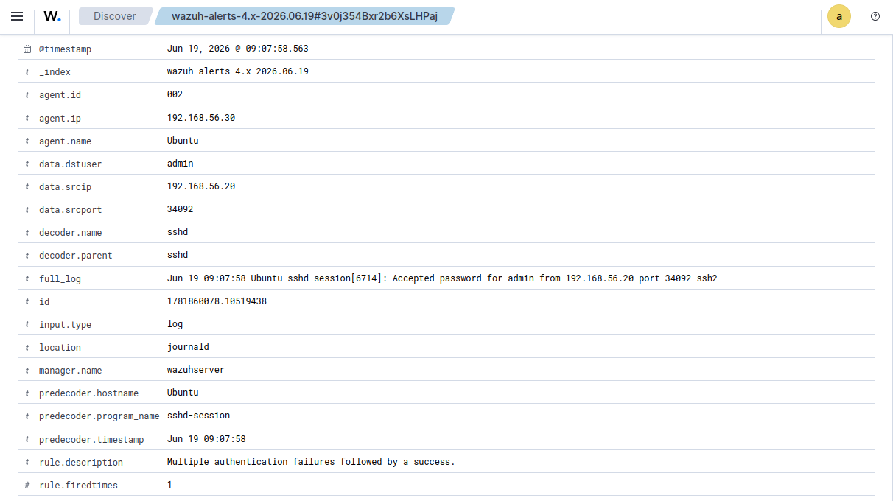
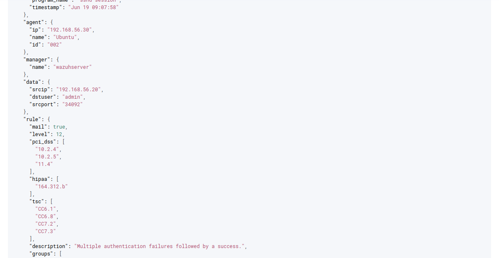

# 🚨 SSH Authentication Failure Investigation

> **Status:** ✅ Completed

| Field                  | Value                                                  |
| ---------------------- | ------------------------------------------------------ |
| **Investigation Type** | SSH Authentication Investigation                       |
| **Platform**           | Ubuntu Linux                                           |
| **SIEM**               | Wazuh                                                  |
| **Source Host**        | Kali Linux                                             |
| **Detection**          | Multiple authentication failures followed by a success |
| **Severity**           | Medium / High (Lab Simulation)                         |

---

## Executive Summary

This investigation analyzes multiple failed SSH authentication attempts followed by a successful login, as detected by Wazuh SIEM within a controlled cybersecurity home lab.

The authentication activity was intentionally generated by repeatedly entering incorrect SSH credentials from a Kali Linux system to an Ubuntu endpoint before successfully authenticating. Wazuh collected, correlated, and generated alerts for these authentication events, demonstrating how suspicious login activity is identified and investigated within a Security Operations Center (SOC).

This case study focuses on validating the generated alerts, analyzing authentication logs, identifying the source of the activity, and understanding how similar behavior could indicate credential attacks or unauthorized access attempts in a production environment.

---

## 🎯 Objective

The objective of this investigation was to analyze SSH authentication events generated by repeated failed login attempts followed by a successful authentication within a controlled cybersecurity home lab.

During this exercise, Wazuh SIEM was used to collect, correlate, and analyze authentication logs from an Ubuntu endpoint. The investigation focused on validating the generated alerts, identifying the source of the authentication attempts, reviewing event details, and understanding how similar authentication behavior may indicate credential-based attacks or unauthorized access attempts in production environments.

---

## 🖥️ Lab Environment

| Component                   | Purpose                                                    |
| --------------------------- | ---------------------------------------------------------- |
| Kali Linux                  | Client system used to generate SSH authentication attempts |
| Ubuntu Desktop              | Target Linux endpoint running the SSH service              |
| Wazuh Server                | Centralized SIEM platform                                  |
| Wazuh Agent                 | Collected authentication logs from Ubuntu                  |
| VirtualBox Internal Network | Isolated environment for safe testing                      |

---

## ⚔️ Attack Simulation

The authentication events were intentionally generated in a controlled lab environment.

### Steps Performed

1. Connected from Kali Linux to the Ubuntu SSH service.
2. Entered an incorrect password multiple times.
3. Generated multiple failed SSH authentication events.
4. Successfully authenticated using valid credentials.
5. Reviewed and investigated the generated Wazuh alerts.

> **Note:** No automated brute-force tools (such as Hydra) were used. Authentication failures were manually generated to simulate suspicious login activity.

---

## 🚨 Detection Summary

Wazuh successfully detected and correlated the authentication events generated during the exercise.

### Key Alerts Observed

* `sshd: authentication failed`
* `unix_chkpwd: Password check failed`
* `PAM: User login failed`
* `sshd: brute force trying to get access to the system`
* `Multiple authentication failures followed by a success`

The final correlated alert identified repeated authentication failures followed by a successful login, a pattern that should always be reviewed by SOC analysts.

---

## 🔍 Investigation Process

The investigation was performed using the **Wazuh Threat Hunting** module.

The following information was analyzed:

* Source IP Address
* Destination Endpoint
* Username
* Authentication Status
* Rule ID
* Rule Severity
* Alert Timeline
* Rule Description
* Event JSON

The investigation confirmed that the authentication activity originated from the Kali Linux system within the isolated home lab.

---

## 📷 Evidence

### 1. Kali Linux SSH Authentication Attempts

---

### 2. Wazuh Threat Hunting Events

---

### 3. Password Check Failed Alert

---

### 4. Multiple Authentication Failures Followed by Success

---

### 5. Event JSON

---

## 🎯 MITRE ATT&CK Mapping

| Technique               | Description                                                      |
| ----------------------- | ---------------------------------------------------------------- |
| **T1110 – Brute Force** | Multiple failed authentication attempts against a valid account. |

Although the authentication failures were intentionally generated for learning purposes, the resulting detection demonstrates authentication behavior that may resemble brute-force activity and should always be investigated.

---

## 📝 Analyst Assessment

The investigation confirmed that the authentication events were intentionally generated within a controlled cybersecurity home lab.

In a production environment, an analyst should:

* Verify whether the source IP is trusted.
* Confirm the legitimacy of the user account.
* Review previous authentication history.
* Determine whether similar activity exists on additional systems.
* Validate whether the successful login was authorized.

Repeated authentication failures followed by a successful login may indicate credential guessing, password spraying, or other unauthorized authentication attempts and should always receive further investigation.

---

## 💡 Recommendations

* Investigate repeated authentication failures promptly.
* Verify successful logins that occur after multiple failures.
* Monitor repeated authentication attempts from the same source IP.
* Enable Multi-Factor Authentication (MFA) where possible.
* Configure account lockout policies.
* Continuously monitor authentication events using a SIEM platform.

---

## 📚 Lessons Learned

* Authentication logs provide valuable forensic evidence.
* Wazuh effectively correlates related authentication events.
* Event correlation significantly improves analyst visibility.
* Reviewing raw event details and JSON enhances investigation accuracy.
* Authentication anomalies should always be validated before determining their legitimacy.

---

## 🛠️ Skills Demonstrated

* Security Event Investigation
* Wazuh SIEM
* Threat Hunting
* Authentication Log Analysis
* Linux Security Monitoring
* Alert Validation
* Event Correlation
* SOC Investigation Workflow
* MITRE ATT&CK Mapping
* Incident Documentation

---

## ✅ Conclusion

This investigation demonstrated how Wazuh SIEM detects, correlates, and presents authentication events for analyst review.

By generating multiple failed SSH authentication attempts followed by a successful login, I gained practical experience investigating authentication alerts, validating event details, analyzing security logs, and documenting findings using a structured SOC investigation workflow.

This investigation demonstrates my ability to simulate, detect, investigate, and document authentication-related security events using Wazuh SIEM in a structured SOC workflow. It serves as a practical example of the analytical and documentation skills expected of an entry-level SOC Analyst.
