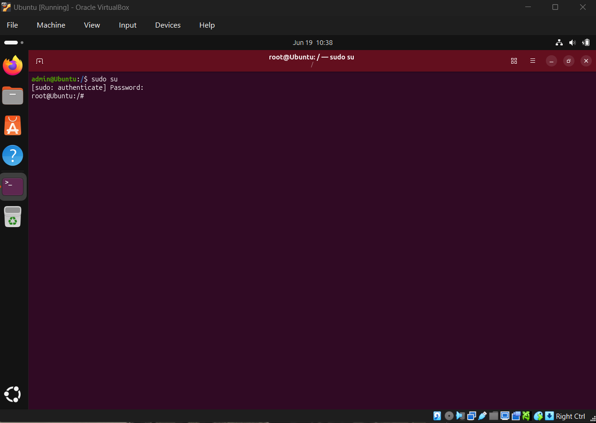
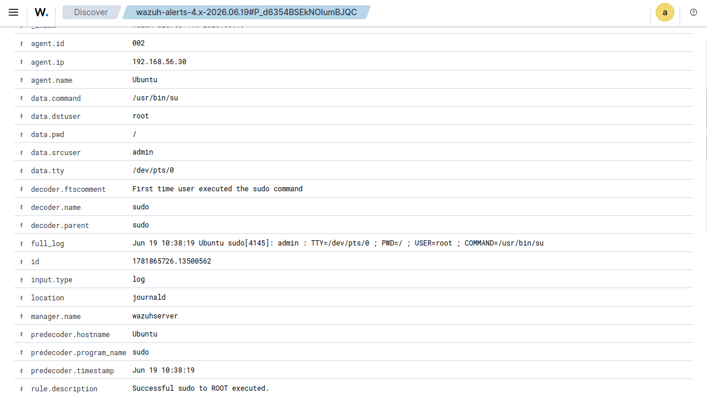
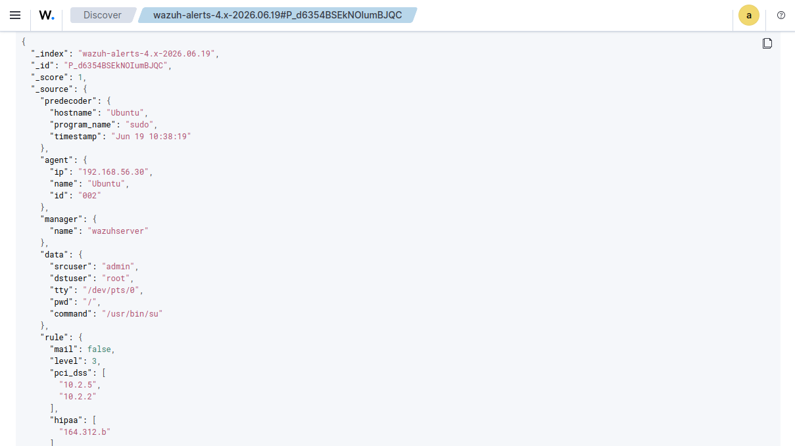

# 🔐 Linux Privilege Escalation Investigation (sudo su)

> **Status:** ✅ Completed

| Field                  | Value                                    |
| ---------------------- | ---------------------------------------- |
| **Investigation Type** | Linux Privilege Escalation Investigation |
| **Platform**           | Ubuntu Linux                             |
| **SIEM**               | Wazuh                                    |
| **Detection**          | Successful sudo to ROOT executed         |
| **Severity**           | Low (Lab Simulation)                     |

---

## Executive Summary

This investigation documents a Linux privilege escalation event generated by executing the `sudo su` command on an Ubuntu endpoint. The activity was detected and logged by Wazuh SIEM, providing visibility into the transition from a standard user account to the root account.

The event was intentionally generated within a controlled cybersecurity home lab to demonstrate how privilege escalation activity is monitored, collected, and investigated by a Security Operations Center (SOC).

This case study focuses on validating the generated alert, reviewing event details, analyzing user activity, and understanding how similar events should be investigated in production environments.

---

## 🎯 Objective

The objective of this investigation was to analyze a successful privilege escalation event generated through the `sudo su` command.

During this exercise, authentication logs were collected from the Ubuntu endpoint by the Wazuh agent and forwarded to the Wazuh SIEM platform for analysis.

The investigation focused on validating the alert, identifying the initiating user, confirming the elevated account, reviewing the executed command, and understanding how privilege escalation monitoring assists SOC analysts during incident investigations.

---

## 🖥️ Lab Environment

| Component                   | Purpose                                            |
| --------------------------- | -------------------------------------------------- |
| Ubuntu Desktop              | Linux endpoint where privilege escalation occurred |
| Wazuh Agent                 | Collected authentication logs                      |
| Wazuh Server                | Centralized SIEM platform                          |
| Kali Linux                  | Administrative workstation within the lab          |
| VirtualBox Internal Network | Isolated environment for safe testing              |

---

## ⚙️ Activity Performed

The following activity was intentionally performed inside the cybersecurity home lab.

### Steps Performed

1. Logged into the Ubuntu endpoint.
2. Executed the following command:

```bash
sudo su
```

3. Entered the user's password.
4. Successfully switched from the **admin** account to the **root** account.
5. The Wazuh agent collected the authentication event.
6. The event was forwarded to Wazuh SIEM.
7. The event was investigated using the Wazuh Threat Hunting module.

> **Note:** This activity was intentionally performed for educational purposes inside an isolated cybersecurity home lab.

---

## 🚨 Detection Summary

Wazuh successfully detected the privilege escalation event.

### Detection Details

| Field            | Value                            |
| ---------------- | -------------------------------- |
| Rule ID          | 5402                             |
| Rule Description | Successful sudo to ROOT executed |
| Decoder          | sudo                             |
| Executed Command | /usr/bin/su                      |
| Source User      | admin                            |
| Destination User | root                             |

The generated alert confirms that Wazuh successfully monitored and collected the privilege escalation activity for investigation.

---

## 🔍 Investigation Process

The investigation was performed using the **Wazuh Threat Hunting** module.

The following event attributes were reviewed:

* Timestamp
* Agent Name
* Source User
* Destination User
* Executed Command
* Working Directory
* Terminal (TTY)
* Rule ID
* Rule Description
* Event JSON

The investigation confirmed that the privilege escalation originated from the local Ubuntu endpoint and was successfully executed using the `sudo` command.

---

## 📷 Evidence

### 1. Privilege Escalation Command



---

### 2. Wazuh Threat Hunting Events


---

### 3. Event Details



---

### 4. Event JSON



---

## 🔍 Event Analysis

The investigation identified the following important fields:

| Field             | Observation                      |
| ----------------- | -------------------------------- |
| Agent             | Ubuntu                           |
| Source User       | admin                            |
| Destination User  | root                             |
| Executed Command  | /usr/bin/su                      |
| Decoder           | sudo                             |
| Rule ID           | 5402                             |
| Detection         | Successful sudo to ROOT executed |
| Working Directory | /                                |
| Terminal          | /dev/pts/0                       |

The event confirms that the **admin** account successfully elevated privileges to the **root** account using the `sudo` command.

---

## 🎯 MITRE ATT&CK Mapping

| Technique                                     | Description                                                                          |
| --------------------------------------------- | ------------------------------------------------------------------------------------ |
| **T1548 – Abuse Elevation Control Mechanism** | Adversaries may abuse elevation mechanisms such as sudo to obtain higher privileges. |

Although this activity was intentionally generated in a controlled lab environment, unauthorized privilege escalation attempts should always be investigated within production environments.

---

## 📝 Analyst Assessment

The investigation confirmed that the privilege escalation event was intentionally generated for educational purposes inside the cybersecurity home lab.

From a SOC perspective, analysts should verify:

* Whether the initiating user is authorized.
* Whether the executed command is expected.
* Whether privilege escalation occurred during approved administrative activities.
* Whether similar events occurred across additional systems.
* Whether the activity aligns with organizational policies.

Successful privilege escalation events are not inherently malicious; however, unexpected or unauthorized privilege escalation should always receive immediate investigation.

---

## 💡 Recommendations

* Continuously monitor sudo activity.
* Review all successful privilege escalation events.
* Restrict sudo access using the principle of least privilege.
* Audit privileged accounts regularly.
* Monitor repeated privilege escalation attempts.
* Correlate privilege escalation with authentication and process events.

---

## 📚 Lessons Learned

* Wazuh effectively monitors Linux privilege escalation activity.
* Authentication logs provide valuable forensic evidence.
* Reviewing executed commands improves investigation accuracy.
* Event correlation enhances analyst visibility.
* Privileged account activity should always be monitored.

---

## 🛠️ Skills Demonstrated

* Linux Security Monitoring
* Wazuh SIEM
* Threat Hunting
* Authentication Log Analysis
* Privilege Escalation Analysis
* Linux Event Investigation
* Event Correlation
* MITRE ATT&CK Mapping
* SOC Investigation Workflow
* Incident Documentation

---

## ✅ Conclusion

This investigation demonstrated how Wazuh detects and records Linux privilege escalation events performed through the `sudo` command.

By intentionally executing `sudo su` within a controlled cybersecurity home lab, I gained practical experience investigating privileged account activity, validating security alerts, analyzing authentication logs, reviewing event metadata, and documenting findings using a structured SOC investigation workflow.

This case study demonstrates my ability to investigate Linux privilege escalation events using Wazuh SIEM while applying practical SOC Analyst skills in threat hunting, authentication monitoring, and security event analysis.
