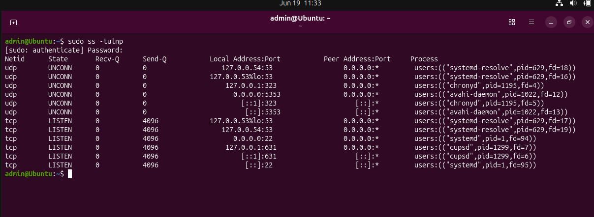
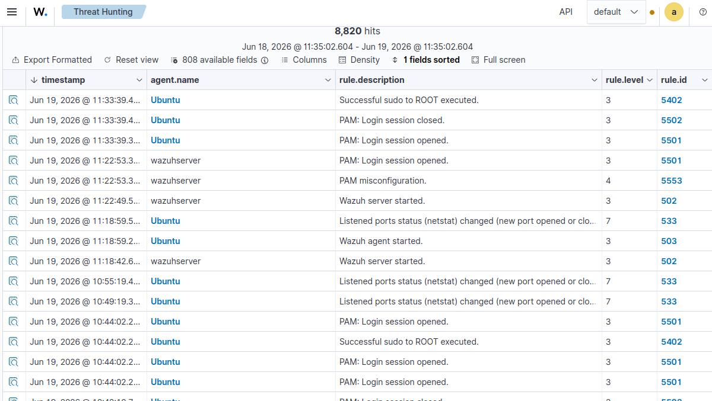
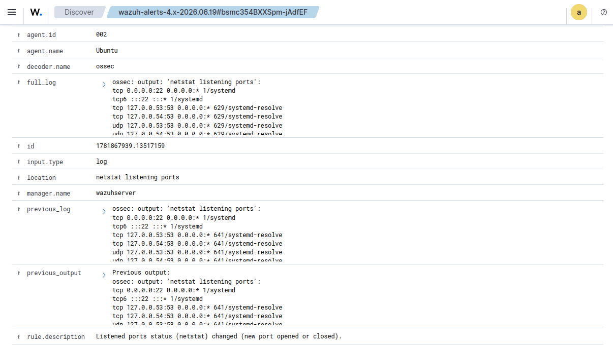
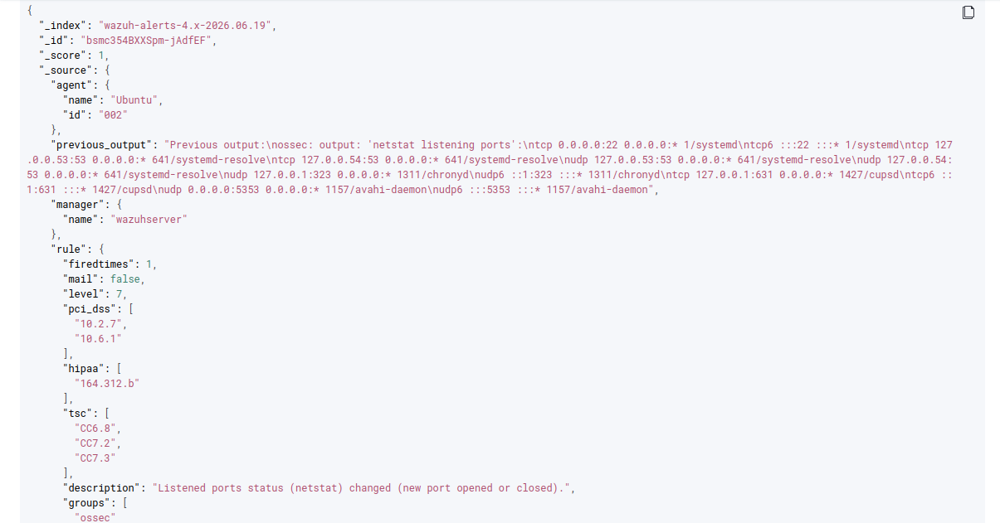

# 🌐 Linux Listening Ports Monitoring Investigation

> **Status:** ✅ Completed

| Field | Value |
|------|------|
| **Investigation Type** | Linux Listening Ports Monitoring |
| **Platform** | Ubuntu Linux |
| **SIEM** | Wazuh |
| **Detection** | Listening Ports Status Changed |
| **Rule ID** | 533 |
| **Severity** | Medium (Lab Simulation) |

---

## Executive Summary

This investigation documents how Wazuh detected changes in the listening ports of an Ubuntu endpoint through its host-based monitoring capabilities.

The activity was intentionally generated inside a controlled cybersecurity home lab to demonstrate how Wazuh continuously monitors network services and alerts analysts whenever listening ports change.

Monitoring listening ports is an important security control because unexpected services may indicate unauthorized applications, persistence mechanisms, malware, or configuration changes. This investigation demonstrates how host-based monitoring can help security analysts identify changes that require further investigation.

---

## 🎯 Objective

The objective of this investigation was to validate how Wazuh detects changes to listening network ports on a Linux endpoint.

The investigation focused on reviewing the generated alert, identifying the affected services, analyzing the event details, and understanding how monitoring listening ports supports host-based threat detection and security monitoring.

---

## 🖥️ Lab Environment

| Component | Purpose |
|-----------|---------|
| Ubuntu Linux | Target endpoint |
| Wazuh Agent | Collected endpoint telemetry |
| Wazuh Server | Centralized SIEM platform |
| VirtualBox Internal Network | Isolated cybersecurity home lab |

---

## ⚙️ Activity Performed

The following activity was intentionally performed inside the cybersecurity home lab.

### Steps Performed

1. Logged into the Ubuntu endpoint.
2. Reviewed active listening ports using the `ss -tulnp` command.
3. Wazuh performed a scheduled netstat inventory comparison.
4. Wazuh detected changes in listening ports.
5. The generated alert was investigated using the Wazuh Threat Hunting module.

> **Note:** This activity was performed inside a controlled cybersecurity home lab for educational purposes.

---

## 🚨 Detection Summary

Wazuh successfully detected changes in the endpoint's listening ports.

### Detection Details

| Field | Value |
|------|------|
| Rule ID | 533 |
| Rule Description | Listened ports status (netstat) changed (new port opened or closed) |
| Decoder | ossec |
| Monitoring Source | Netstat Monitoring |
| Agent | Ubuntu |

The generated alert indicates that Wazuh detected a change in the endpoint's listening network services by comparing previous and current netstat results.

---

## 🔍 Investigation Process

The investigation was performed using the **Wazuh Threat Hunting** module.

The following event attributes were reviewed:

- Agent Name
- Agent IP Address
- Rule ID
- Rule Description
- Decoder
- Full Log
- Previous Log
- Previous Output
- Event Timestamp

The investigation confirmed that Wazuh compared previous and current netstat outputs and generated an alert after detecting changes in the listening ports.

---

## 📷 Evidence

### 1. Listening Ports Output

---

### 2. Wazuh Threat Hunting Events

---

### 3. Event Details

---

### 4. Event JSON

---

## 🔍 Event Analysis

The investigation identified the following important fields.

| Field | Observation |
|------|-------------|
| Agent | Ubuntu |
| Rule ID | 533 |
| Detection | Listening Ports Status Changed |
| Decoder | ossec |
| Monitoring Source | Netstat |
| Event Type | Host Monitoring |

The collected telemetry confirms that Wazuh successfully identified changes in the endpoint's listening ports by comparing the current network service inventory against the previous baseline.

---

## 🎯 MITRE ATT&CK Mapping

| Technique | Description |
|-----------|-------------|
| **T1046 – Network Service Discovery** | Identifying listening network services that may expose systems to unauthorized access or reconnaissance. |

Although this activity occurred inside a controlled lab environment, monitoring listening ports helps security analysts identify newly exposed services that could indicate unauthorized software, persistence mechanisms, or configuration changes.

---

## 📝 Analyst Assessment

The investigation confirmed that Wazuh successfully detected changes in the endpoint's listening network services.

From a SOC perspective, analysts should verify:

- Which process opened the listening port.
- Whether the exposed service is expected.
- Whether the change was authorized.
- Whether similar changes occurred across other systems.
- Whether the newly exposed service introduces security risks.

Unexpected listening ports should always be investigated because they may indicate unauthorized software, persistence techniques, misconfigurations, or malicious activity.

---

## 💡 Recommendations

- Continuously monitor listening ports on critical systems.
- Investigate newly opened network services.
- Remove unnecessary services.
- Review firewall configurations regularly.
- Correlate listening port changes with process creation events.
- Maintain an approved baseline of expected network services.

---

## 📚 Lessons Learned

- Wazuh continuously monitors changes in listening network services.
- Baseline comparisons improve anomaly detection.
- Network service monitoring strengthens host visibility.
- Event correlation helps identify unauthorized changes.
- Listening port monitoring supports proactive threat hunting.

---

## 🛠️ Skills Demonstrated

- Linux Security Monitoring
- Wazuh SIEM
- Threat Hunting
- Network Service Monitoring
- Host-based Detection
- Security Event Analysis
- Log Investigation
- MITRE ATT&CK Mapping
- SOC Investigation Workflow
- Incident Documentation

---

## ✅ Conclusion

This investigation demonstrated how Wazuh detects changes in listening network ports using host-based monitoring.

By analyzing Rule 533 alerts, I gained practical experience validating host monitoring events, reviewing system telemetry, investigating network service changes, and documenting findings using a structured SOC investigation workflow.

This investigation demonstrates practical SOC Analyst skills in Linux monitoring, host-based detection, threat hunting, and security event analysis using Wazuh SIEM.
