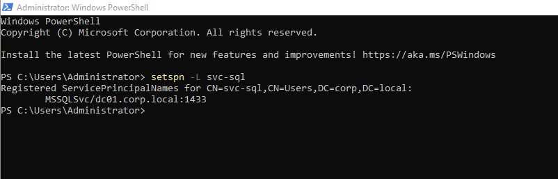
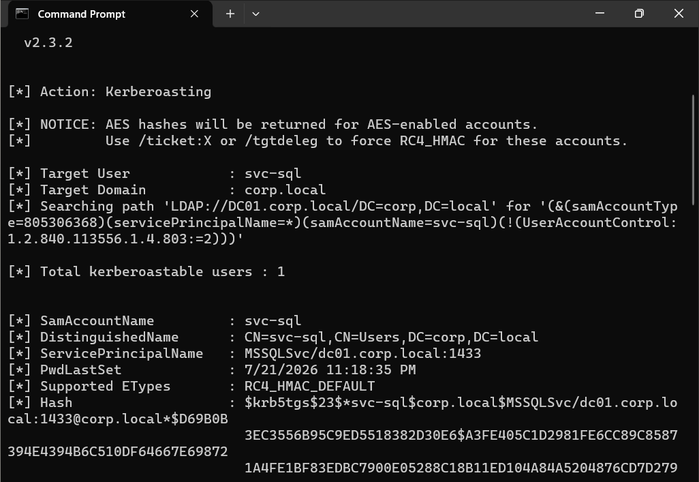
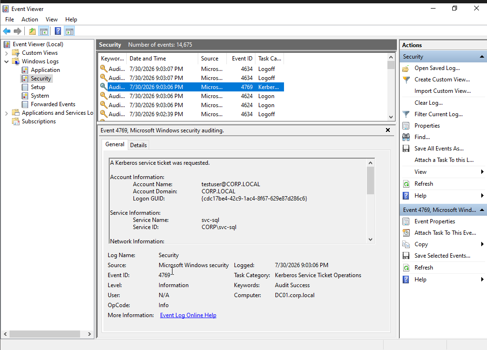
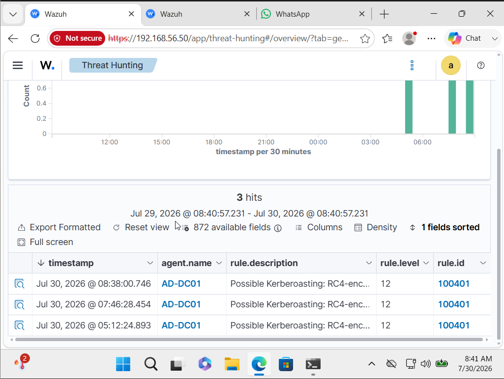
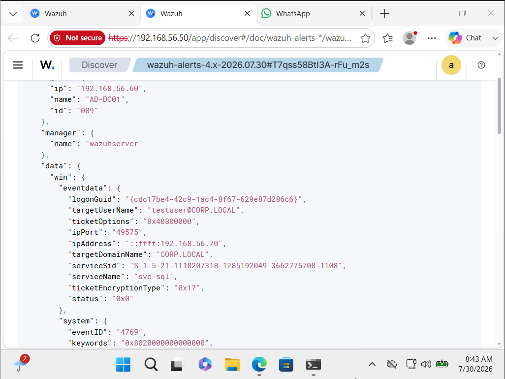
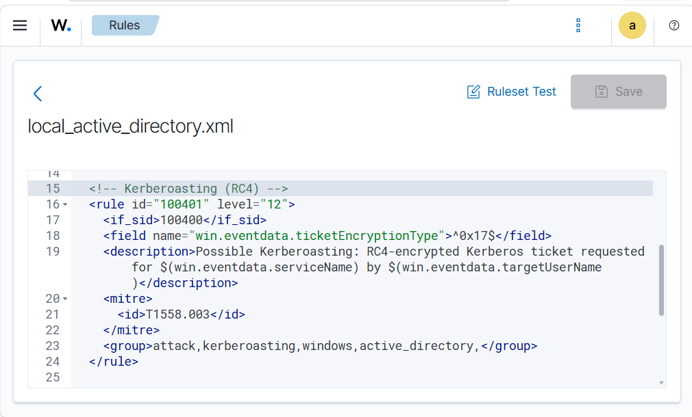
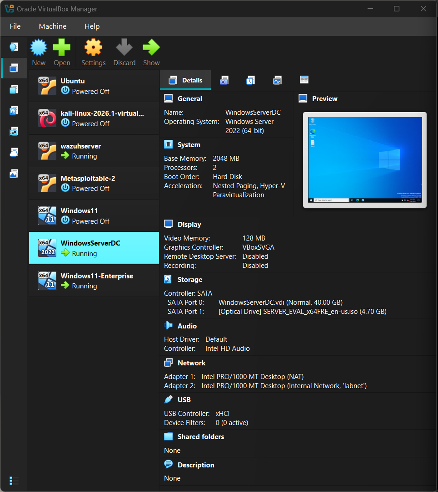

# SOC Investigation #07: Detecting a Kerberoasting Attack with Wazuh SIEM

## Overview

This investigation demonstrates how a **Kerberoasting attack** can be simulated and detected in an Active Directory environment using **Wazuh SIEM**. A vulnerable service account with a registered Service Principal Name (SPN) was targeted using **Rubeus**, generating a Kerberos service ticket request (Event ID 4769). Windows Security logs were collected by Wazuh, and a custom detection rule identified the attack based on the use of **RC4 encryption (0x17)**.

---

# Objectives

- Configure a Kerberoastable service account
- Simulate a Kerberoasting attack using Rubeus
- Monitor Kerberos activity using Windows Event Logs
- Detect suspicious ticket requests with Wazuh
- Investigate the generated security alert
- Map the activity to the MITRE ATT&CK framework

---

# Lab Environment

| Component | Details |
|-----------|---------|
| SIEM | Wazuh 4.x |
| Domain Controller | Windows Server 2022 |
| Client | Windows 11 Enterprise |
| Attack Tool | Rubeus v2.3.2 |
| Domain | CORP.LOCAL |
| Service Account | svc-sql |
| SPN | MSSQLSvc/dc01.corp.local:1433 |

---

# Attack Workflow

```
Windows 11 Client
(testuser)
        │
        │ Rubeus Kerberoast
        ▼
Domain Controller
(Event ID 4769)
        │
        ▼
Wazuh Agent
        │
        ▼
Wazuh Manager
        │
        ▼
Custom Rule 100401
        │
        ▼
SOC Investigation
```

---

# MITRE ATT&CK

| Tactic | Technique | ID |
|---------|-----------|----|
| Credential Access | Kerberoasting | T1558.003 |

---

# Investigation Steps

## Step 1 – Configure the Service Account

A service account named **svc-sql** was configured with a Service Principal Name (SPN), making it eligible for Kerberos service ticket requests.

**Command**

```powershell
setspn -L svc-sql
```

### Screenshot



---

## Step 2 – Simulate the Kerberoasting Attack

Using Rubeus, a Kerberos service ticket was requested for the service account.

**Command**

```cmd
Rubeus.exe kerberoast /user:svc-sql
```

The tool successfully retrieved the Kerberos TGS hash.

### Screenshot



---

## Step 3 – Windows Event Generation

The Domain Controller logged **Windows Security Event ID 4769**, indicating that a Kerberos service ticket had been requested.

Important fields observed:

- Event ID: 4769
- Account Name: testuser@CORP.LOCAL
- Service Name: svc-sql
- Client Address: 192.168.56.70

### Screenshot



---

## Step 4 – Wazuh Detection

The Windows Security event was forwarded to Wazuh, where a custom detection rule identified the activity as a potential Kerberoasting attack.

**Rule ID**

```
100401
```

**Alert Severity**

```
12 (High)
```

### Screenshot



---

## Step 5 – Alert Analysis

The Wazuh event contained the following indicators:

| Field | Value |
|------|-------|
| Event ID | 4769 |
| User | testuser@CORP.LOCAL |
| Service Account | svc-sql |
| Source IP | 192.168.56.70 |
| Ticket Encryption | 0x17 (RC4) |
| Status | Success |

The alert was generated because the Kerberos service ticket was issued using **RC4 encryption (0x17)**, a common characteristic monitored during Kerberoasting detection.

### Screenshot



---

## Step 6 – Detection Engineering

A custom Wazuh rule was created to identify RC4-encrypted Kerberos service ticket requests associated with Event ID 4769.

The rule:

- Extends the default Kerberos detection
- Detects RC4 (0x17) encryption
- Maps the alert to MITRE ATT&CK T1558.003
- Generates a High Severity alert

### Screenshot



---

# Indicators of Compromise (IOCs)

| Indicator | Value |
|-----------|-------|
| Event ID | 4769 |
| Rule ID | 100401 |
| User | testuser@CORP.LOCAL |
| Service Account | svc-sql |
| Source IP | 192.168.56.70 |
| Encryption | RC4 (0x17) |

---

# Detection Logic

The custom detection rule identifies:

- Windows Security Event ID 4769
- Kerberos service ticket requests
- RC4 encryption (0x17)

These indicators together provide a strong signal of potential Kerberoasting activity that warrants analyst investigation.

---

# Recommendations

- Use long, randomly generated passwords for service accounts.
- Prefer AES encryption over RC4 whenever possible.
- Implement Group Managed Service Accounts (gMSAs).
- Monitor Event ID 4769 for abnormal service ticket requests.
- Audit Service Principal Names (SPNs) regularly.
- Investigate repeated TGS requests from the same user or workstation.

---

# Screenshots

| Screenshot | Description |
|------------|-------------|
|  | Lab Architecture |
|  | SPN Configuration |
|  | Kerberoasting Attack |
|  | Windows Event ID 4769 |
|  | Wazuh Detection |
|  | Alert Details |
|  | Custom Detection Rule |

---

# Skills Demonstrated

- Active Directory Administration
- Kerberos Authentication
- Kerberoasting Attack Simulation
- Windows Event Log Analysis
- Wazuh SIEM
- Detection Engineering
- Threat Hunting
- MITRE ATT&CK Mapping
- SOC Investigation

---

# Conclusion

This investigation demonstrates the end-to-end detection of a Kerberoasting attack within an Active Directory environment. The attack was simulated using Rubeus, captured through Windows Security Event ID 4769, and successfully detected by Wazuh using a custom detection rule. The project highlights practical experience in Active Directory security, SIEM monitoring, event analysis, and detection engineering, reflecting the workflow of a SOC analyst investigating credential access techniques.