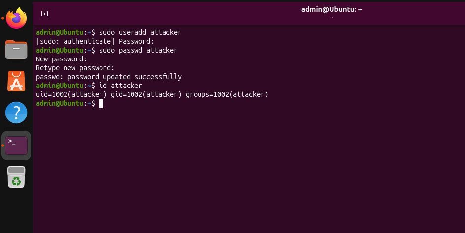
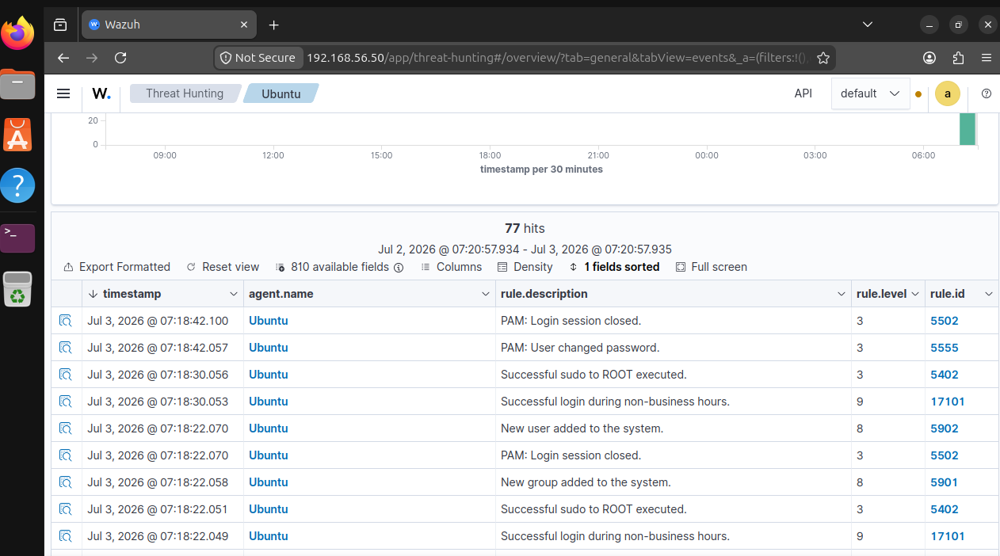
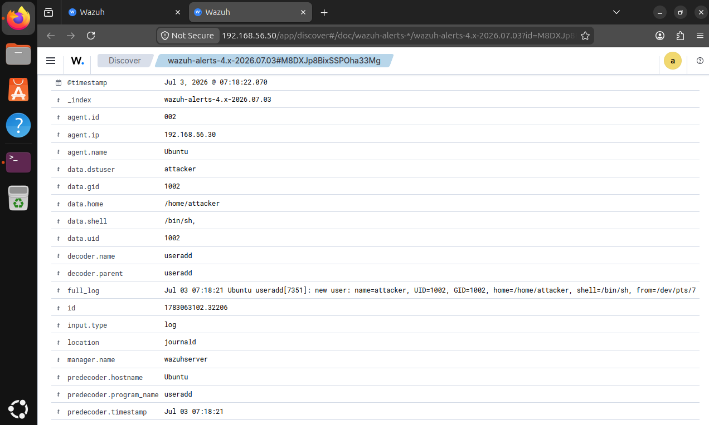

# Linux User Account Creation with Wazuh SIEM

## Objective

Investigate the creation of a new Linux user account on an Ubuntu endpoint and analyze how Wazuh SIEM detects, logs, and presents the associated security events.

---

# Investigation Scenario

A new local Linux user account named **attacker** was intentionally created on the monitored Ubuntu endpoint.

The objective of this investigation was to validate whether Wazuh could detect the account creation, collect the relevant logs, and provide sufficient information for a SOC analyst to investigate the activity.

---

# Lab Environment

| Machine | Role |
|----------|------|
| Ubuntu | Monitored Linux Endpoint |
| Wazuh Server | SIEM Platform |

---

# Tools Used

- Wazuh SIEM
- Ubuntu Linux
- Linux Terminal
- systemd-journald

---

# MITRE ATT&CK Mapping

| Technique | ID |
|----------|------|
| Create Account | T1136 |

---

# Investigation Process

## Step 1 – Create a New User

A new local user account named **attacker** was created using the `useradd` command.

The account password was configured using the `passwd` command and verified using the `id` command.

### Screenshot

---

## Step 2 – Monitor Wazuh Alerts

After the account was created, Wazuh generated multiple security events, including:

- New user added to the system
- New group added to the system
- Successful sudo to ROOT executed
- PAM authentication events
- User password changed

These alerts confirmed that Wazuh successfully monitored the activity performed on the Linux endpoint.

### Screenshot

---

## Step 3 – Analyze Alert Details

The detailed Wazuh event provided valuable forensic information, including:

- Username
- UID
- GID
- Home directory
- Default shell
- Decoder information
- Log source
- Complete event log
- Timestamp

This information allows a SOC analyst to reconstruct the account creation event and validate the activity.

### Screenshot

---

# Investigation Findings

- Wazuh successfully detected the creation of the new Linux user account.
- Multiple correlated security events were generated during the activity.
- The SIEM collected detailed forensic information, including:
  - Username
  - UID
  - GID
  - Home directory
  - Default shell
  - Decoder information
  - Timestamp
  - Complete event log
- The Linux terminal activity matched the events recorded in Wazuh, confirming accurate detection and successful log collection.

---

# Skills Practiced

- Wazuh SIEM
- Linux User Administration
- Security Event Investigation
- Authentication Log Analysis
- Linux Endpoint Monitoring
- MITRE ATT&CK Mapping
- SOC Analyst Workflow

---

# Lessons Learned

- Linux user account creation generates multiple security events rather than a single alert.
- Wazuh provides excellent visibility into Linux endpoint activities through system logs.
- Correlating terminal activity with SIEM alerts helps validate administrative actions.
- Event metadata such as usernames, UIDs, GIDs, and timestamps provides valuable forensic evidence during investigations.

---

# Conclusion

This investigation demonstrated how Wazuh SIEM detects Linux user account creation events and provides detailed forensic information for SOC analysts. By correlating Linux commands with SIEM alerts, analysts can quickly verify administrative activities and identify potentially suspicious account creation events.
