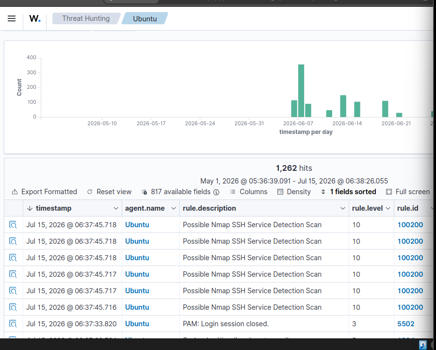
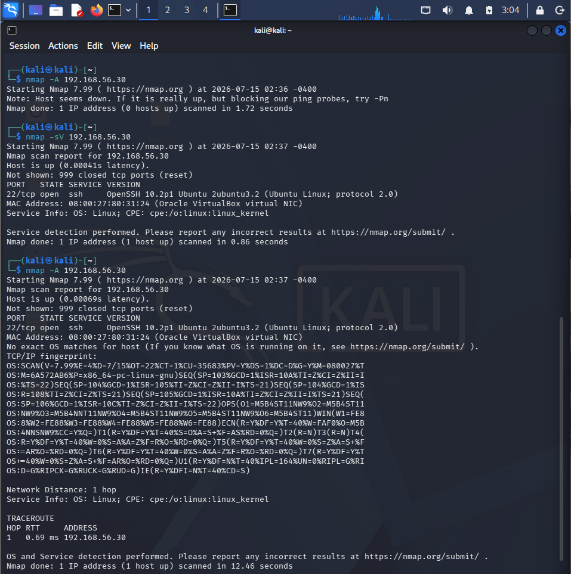
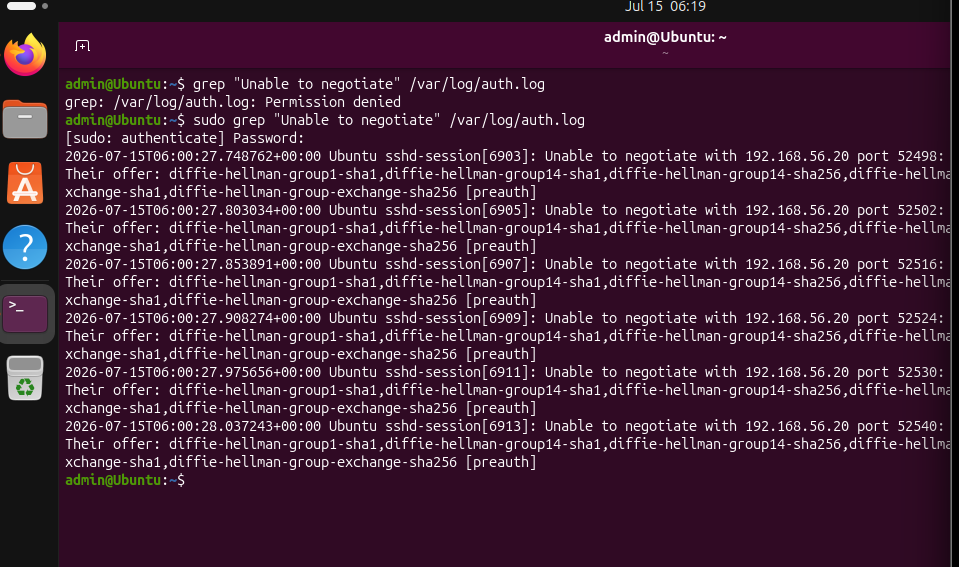
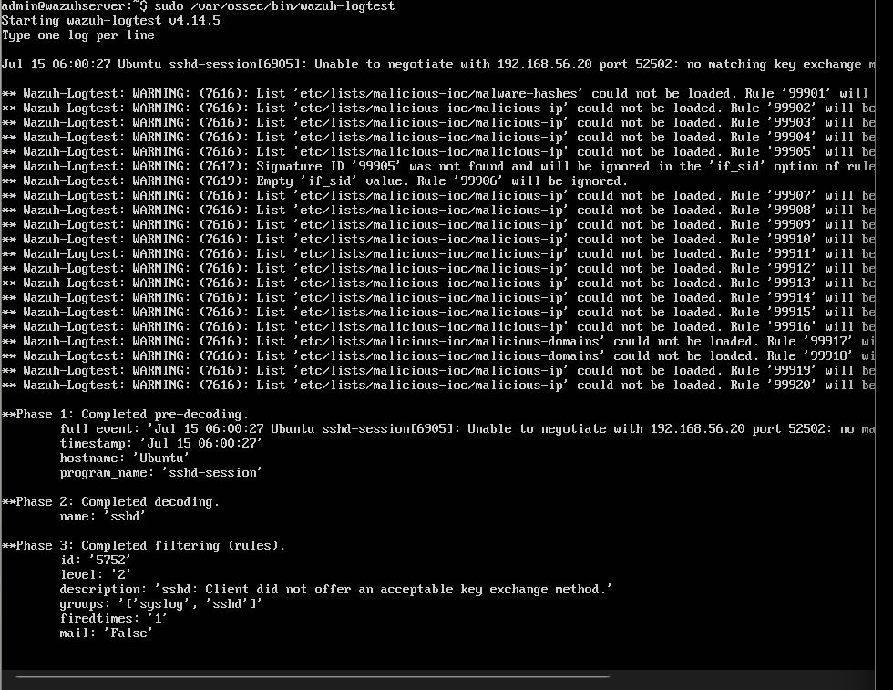
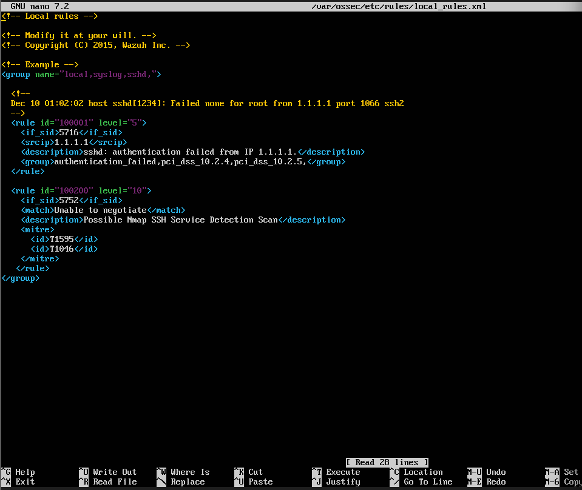
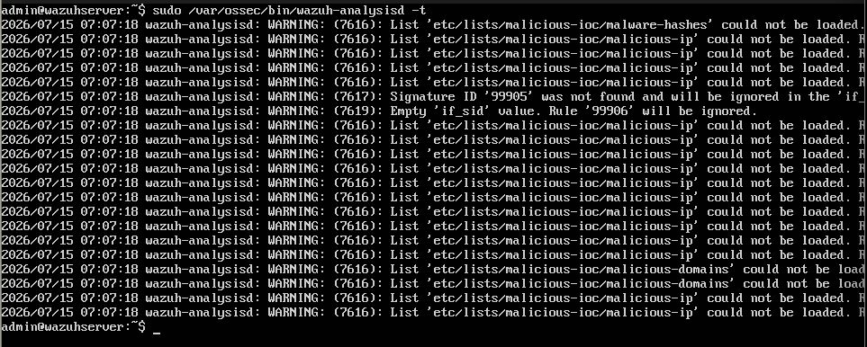

# SOC Investigation #06: Detecting Nmap SSH Service Detection with a Custom Wazuh Rule



---

# Overview

In this investigation, I simulated an **Nmap SSH Service Detection** attack from a Kali Linux attacker machine against an Ubuntu endpoint monitored by **Wazuh SIEM**.

Although Wazuh successfully parsed the SSH authentication logs, it did not generate a dedicated alert for this reconnaissance activity by default.

To improve detection coverage, I analyzed the generated logs, identified the correct parent rule using **Wazuh Logtest**, and developed a **custom Wazuh detection rule** that successfully detects Nmap SSH Service Detection attempts.

---

# Lab Environment

| Component | Role |
|-----------|------|
| Kali Linux | Attacker Machine |
| Ubuntu Desktop | Target Endpoint |
| Wazuh Server | SIEM & Detection Platform |
| Oracle VirtualBox | Virtualization Platform |

---

# Objective

Develop and validate a **custom Wazuh detection rule** capable of detecting **Nmap SSH Service Detection** activity against a Linux endpoint.

---

# Attack Simulation

From the Kali Linux attacker machine, I executed:

```bash
sudo nmap -sV <Ubuntu-IP>
```

The `-sV` option performs **service version detection**, allowing Nmap to identify services running on open ports. During this process, Nmap probes the SSH service using multiple protocol negotiation methods.

## Attack Simulation



---

# Evidence Collection

After executing the scan, the Ubuntu endpoint generated SSH authentication logs indicating failed SSH key exchange negotiations.

Command used:

```bash
sudo grep "Unable to negotiate" /var/log/auth.log
```

Example log:

```text
Unable to negotiate with 192.168.56.20 port 52502:
no matching key exchange method found.
```

These logs confirmed that reconnaissance activity reached the SSH service.

## Ubuntu SSH Logs



---

# Investigation Process

## Step 1 – Analyze the Event

To determine how Wazuh interpreted the event, I used:

```bash
sudo /var/ossec/bin/wazuh-logtest
```

Result:

- Decoder: **sshd**
- Parent Rule ID: **5752**
- Description:

```
sshd: Client did not offer an acceptable key exchange method.
```

This identified the correct parent rule required for building the custom detection.

### Wazuh Logtest



---

## Step 2 – Create the Custom Detection Rule

Using the identified parent rule (**5752**), I created the following custom rule inside:

```
/var/ossec/etc/rules/local_rules.xml
```

```xml
<rule id="100200" level="10">
    <if_sid>5752</if_sid>
    <match>Unable to negotiate</match>
    <description>Possible Nmap SSH Service Detection Scan</description>
    <mitre>
        <id>T1595</id>
        <id>T1046</id>
    </mitre>
</rule>
```

The custom rule elevates SSH negotiation failures associated with Nmap reconnaissance into a dedicated high-severity alert.

### Custom Wazuh Rule



---

## Step 3 – Validate the Rule

Before deploying the rule, I validated its syntax using:

```bash
sudo /var/ossec/bin/wazuh-analysisd -t
```

The validation completed successfully without XML syntax errors.

### Rule Validation



---

## Step 4 – Deploy the Rule

After successful validation, I restarted the Wazuh Manager.

```bash
sudo systemctl restart wazuh-manager
```

---

## Step 5 – Verify the Detection

I executed another Nmap service detection scan.

The custom rule successfully generated alerts within **Wazuh Threat Hunting**, confirming that the reconnaissance activity was detected.

### Detection Results


---

# Detection Results

| Rule ID | Severity | Description |
|---------|---------:|-------------|
| **100200** | **10** | Possible Nmap SSH Service Detection Scan |

The custom rule successfully detected SSH service detection activity generated by Nmap.

---

# MITRE ATT&CK Mapping

| Tactic | Technique |
|---------|-----------|
| Reconnaissance | **T1595 – Active Scanning** |
| Discovery | **T1046 – Network Service Scanning** |

---

# Indicators of Compromise (IOCs)

- Source IP: **192.168.56.20**
- Target Service: **SSH (Port 22)**
- SSH banner probing
- Failed SSH key exchange negotiations
- Multiple reconnaissance attempts

---

# Skills Demonstrated

- Wazuh SIEM
- Detection Engineering
- Custom Wazuh Rule Development
- Linux Log Analysis
- SSH Log Investigation
- Nmap Reconnaissance Detection
- Threat Hunting
- MITRE ATT&CK Mapping
- SOC Investigation Workflow

---

# Repository Structure

```text
Nmap-SSH-Service-Detection/
│
├── Readme.md
│
├── Rules/
│   └── local_rules.xml
│
└── Screenshots/
    ├── 01-Nmap-Service-Scan.png
    ├── 02-Ubuntu-SSH-Logs.png
    ├── 03-Wazuh-Logtest.png
    ├── 04-Custom-Wazuh-Rule.png
    ├── 05-Detection-Alert.png
    └── 06-Rule-Validation.png
```

---

# Lessons Learned

- Default SIEM rules do not detect every reconnaissance technique.
- Wazuh Logtest helps identify the correct parent rule before developing custom detections.
- Custom Wazuh rules significantly improve detection coverage.
- Detection engineering is an essential skill for SOC analysts.
- Validating rules before deployment helps prevent configuration issues.

---

# Conclusion

This investigation demonstrates how Wazuh's detection capabilities can be extended beyond its default rule set.

By generating realistic attack telemetry, analyzing endpoint logs, identifying the correct parent rule, developing a custom detection rule, and validating it against live attack activity, I successfully enhanced Wazuh's ability to detect **Nmap SSH Service Detection** attempts.

This project strengthened my practical skills in:

- Threat Hunting
- Linux Log Analysis
- Wazuh SIEM
- Detection Engineering
- Custom Wazuh Rule Development
- MITRE ATT&CK Mapping
- SOC Investigation Workflow
