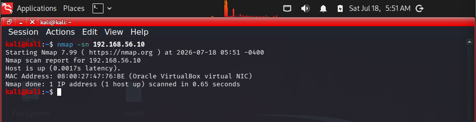
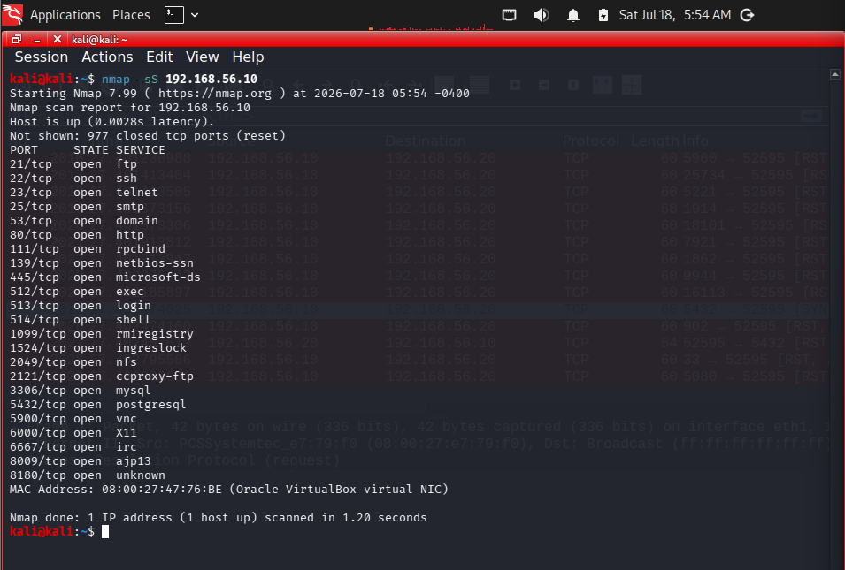
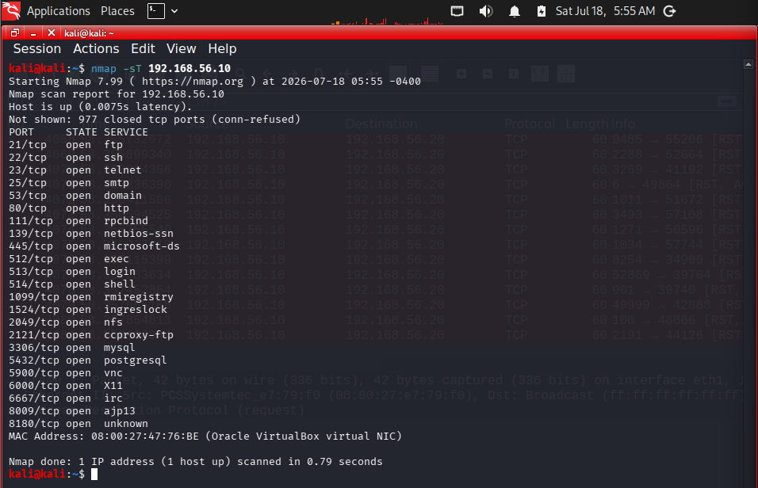
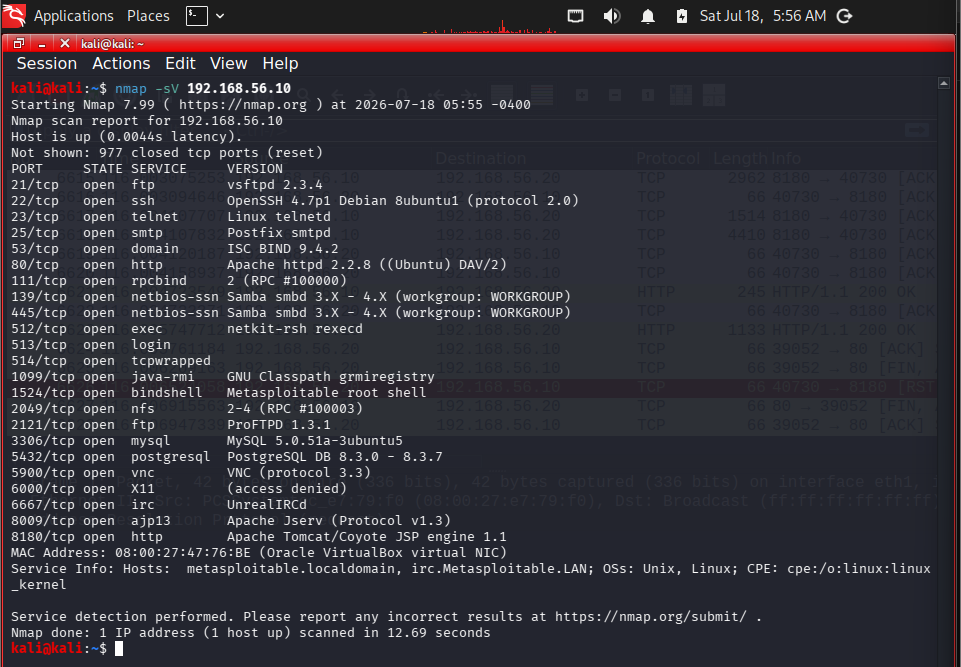
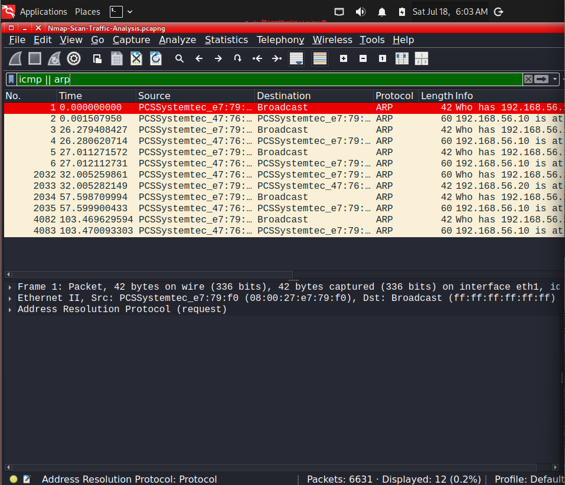
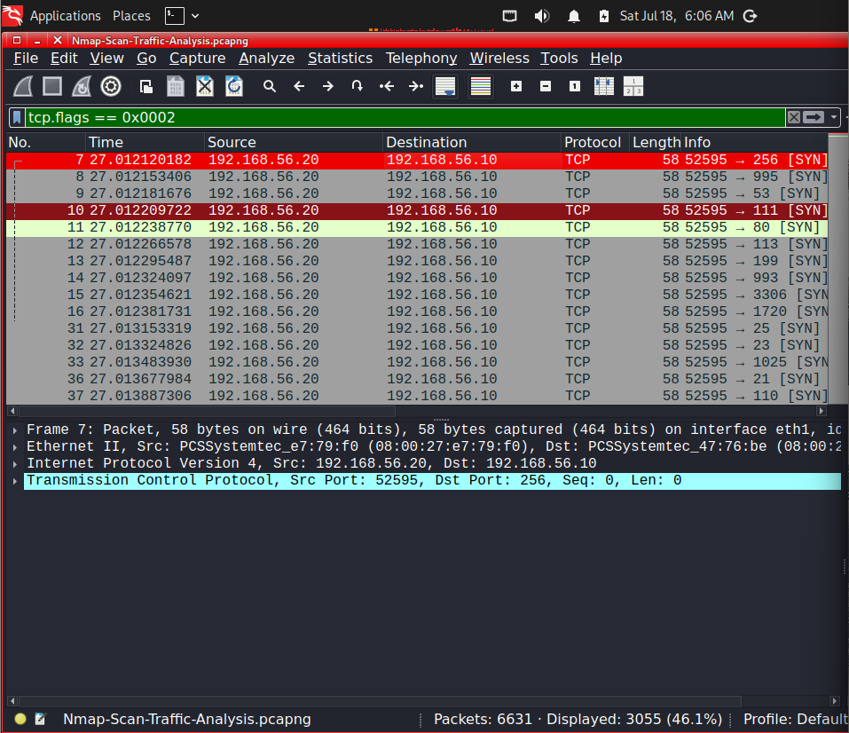
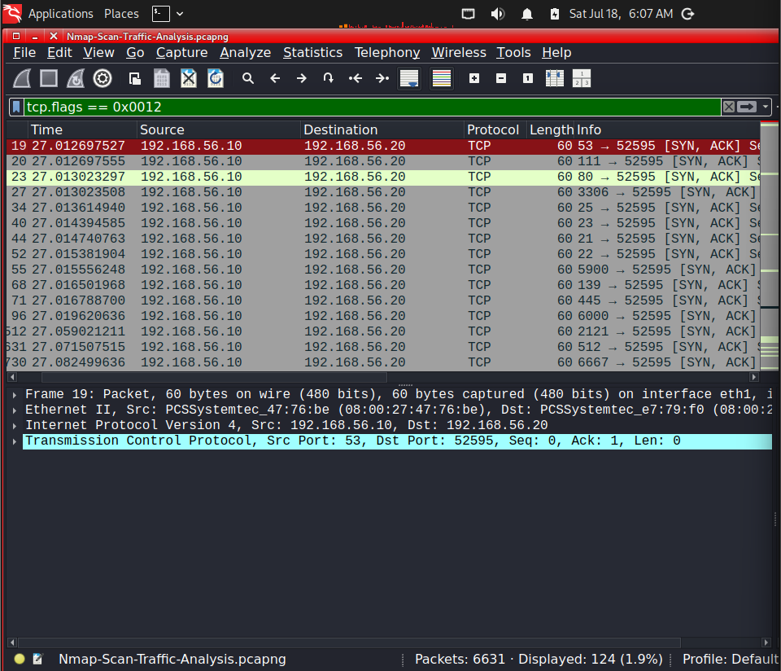
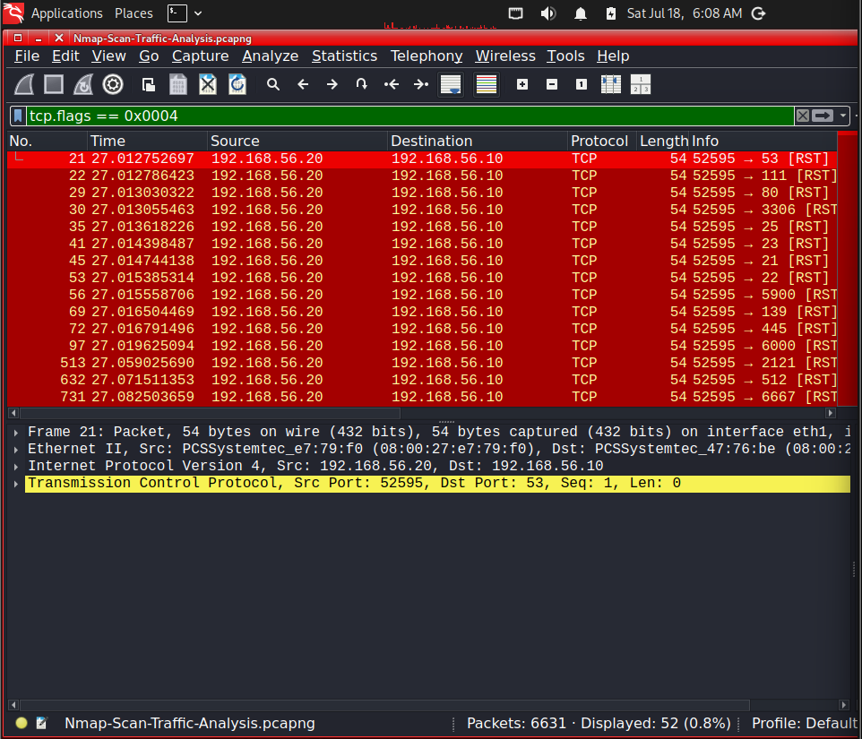
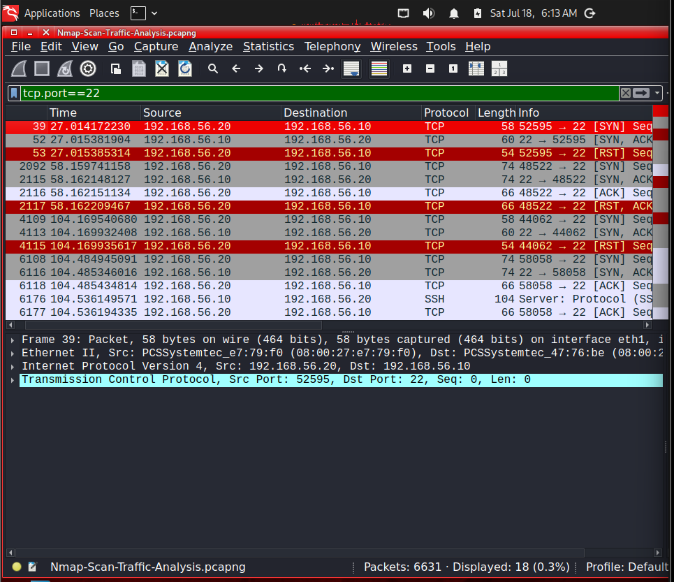
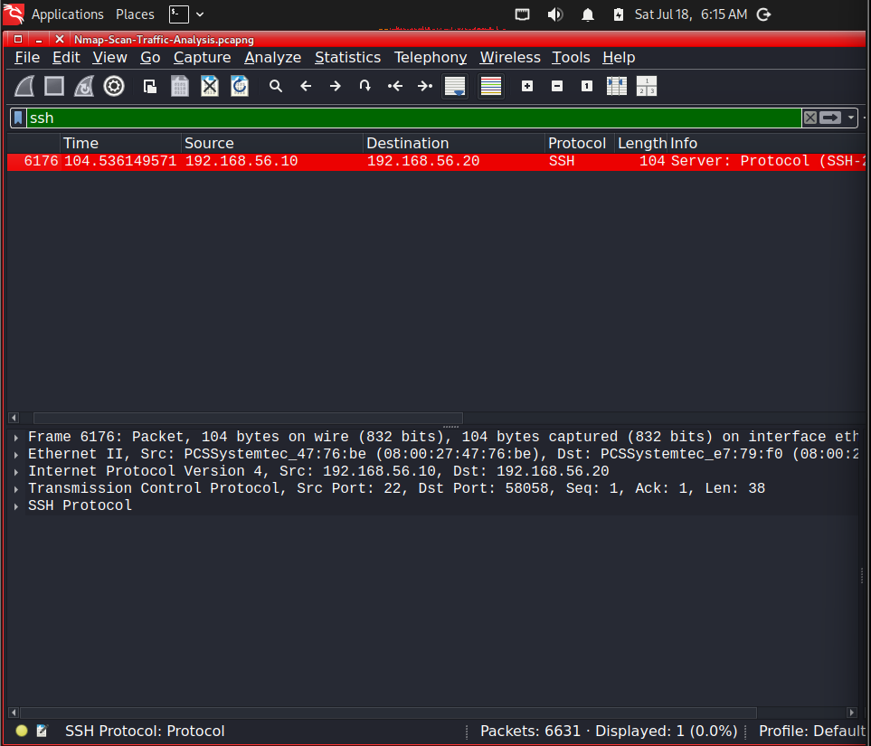

# Nmap Scan Traffic Analysis Using Wireshark

## Objective

Capture and analyze network traffic generated by different Nmap scan techniques using Wireshark. This investigation focuses on understanding how Host Discovery, SYN Scan, TCP Connect Scan, and Service Version Detection appear at the packet level and how reconnaissance activity can be identified from a defender's perspective.

---

# Lab Environment

| Machine | Role | IP Address |
|----------|------|------------|
| Kali Linux | Attacker / Analyst | 192.168.56.20 |
| Metasploitable 2 | Target Server | 192.168.56.10 |

---

# Tools Used

- Wireshark
- Nmap
- Kali Linux
- Metasploitable 2
- VirtualBox

---

# Protocols Analyzed

- ARP
- ICMP
- TCP
- SSH

---

# Investigation Scenario

A host inside the network generated multiple TCP connection attempts against a Linux server. Network traffic was captured using Wireshark to investigate the reconnaissance activity, identify the scan techniques used, and analyze the packet-level behavior of Nmap.

---

# Investigation Process

## Step 1 – Host Discovery

The target was first identified using an ICMP/ARP host discovery scan.

```bash
sudo nmap -sn 192.168.56.10
```

This scan verifies whether the target host is online before performing port scanning.

---

## Step 2 – SYN Scan

A TCP SYN Scan was performed.

```bash
sudo nmap -sS 192.168.56.10
```

This scan identifies open ports by sending SYN packets without completing the TCP connection.

---

## Step 3 – TCP Connect Scan

A full TCP Connect Scan was performed.

```bash
nmap -sT 192.168.56.10
```

Unlike a SYN Scan, this method completes the TCP three-way handshake before closing the connection.

---

## Step 4 – Service Version Detection

Service detection was performed to identify applications running on open ports.

```bash
sudo nmap -sV 192.168.56.10
```

Nmap interacted with application services such as SSH to determine service versions.

---

## Step 5 – Capture Network Traffic

Packet capture was started on the Kali Linux network interface before executing the scans.

The following Wireshark display filters were used during analysis.

### Host Discovery

```text
icmp || arp
```

### SYN Packets

```text
tcp.flags == 0x0002
```

### SYN-ACK Responses

```text
tcp.flags == 0x0012
```

### TCP Reset Packets

```text
tcp.flags == 0x0004
```

### SSH Traffic

```text
ssh
```

---

# Investigation Findings

## Host Discovery

### Key Observations

- ARP Requests and Replies were exchanged.
- ICMP Echo Requests confirmed host availability.
- Target successfully responded to discovery probes.

---

## SYN Scan

### Key Observations

- Multiple TCP SYN packets were transmitted.
- Numerous destination ports were probed.
- TCP connections were not completed.

This behavior is consistent with an Nmap SYN Scan (Half-Open Scan).

---

## SYN-ACK Responses

### Key Observations

- Open ports responded with SYN-ACK packets.
- Responses confirmed that services were actively listening.
- Nmap used these responses to determine open ports.

---

## TCP Reset Packets

### Key Observations

- TCP Reset packets immediately followed SYN-ACK responses.
- Connections were intentionally terminated before completion.

This confirms the behavior of a half-open SYN Scan.

---

## TCP Connect Scan

### Key Observations

- TCP connections completed the three-way handshake.
- Communication progressed beyond SYN and SYN-ACK.
- Application-layer communication became visible.

---

## Service Version Detection

### Key Observations

- SSH protocol negotiation was captured.
- Service banners were exchanged.
- Running services were successfully identified.

---

# Investigation Findings

- Successfully captured Host Discovery traffic.
- Observed TCP SYN packets generated by Nmap.
- Identified SYN-ACK responses from open ports.
- Verified half-open TCP connections using Reset packets.
- Compared SYN Scan and TCP Connect Scan behavior.
- Captured SSH service banner during version detection.
- Successfully identified multiple running network services.

---

# SOC Investigation Notes

Monitoring reconnaissance traffic enables defenders to identify attackers during the earliest phase of an intrusion.

Examples include:

- Active Network Scanning
- Port Enumeration
- Service Enumeration
- Internal Reconnaissance
- Unauthorized Network Discovery

Recognizing these indicators allows SOC analysts to detect reconnaissance before exploitation begins.

---

# Evidence

The original packet capture used during this investigation is available in the **Evidence** folder.

```text
Evidence/
└── Nmap-Scan-Traffic-Analysis.pcapng
```

---

# Screenshots

## Host Discovery



---

## SYN Scan



---

## TCP Connect Scan



---

## Service Version Detection



---

## Host Discovery Packets



---

## SYN Scan Packets



---

## SYN-ACK Responses



---

## TCP Reset Packets



---

## SYN Scan vs TCP Connect Scan



---

## SSH Service Banner



---

# Skills Practiced

- Nmap Scan Analysis
- Wireshark Packet Analysis
- TCP Flag Analysis
- Network Reconnaissance Detection
- Packet Inspection
- Service Enumeration Analysis
- Network Investigation
- SOC Investigation Methodology

---

# Key Learnings

- Understood how Nmap performs host discovery.
- Compared SYN Scan and TCP Connect Scan behavior.
- Learned how TCP flags reveal scanning activity.
- Identified open ports using SYN-ACK responses.
- Observed TCP Reset packets during half-open scans.
- Captured application-layer traffic during service version detection.
- Improved practical packet analysis skills using Wireshark.

---

# MITRE ATT&CK Mapping

| Technique | ID |
|-----------|----|
| Active Scanning | T1595 |
| Network Service Discovery | T1046 |
| Gather Victim Network Information | T1590 |

---

# Conclusion

This investigation provided hands-on experience analyzing Nmap reconnaissance traffic using Wireshark. By examining Host Discovery, SYN Scan, TCP Connect Scan, and Service Version Detection at the packet level, I gained a deeper understanding of how network reconnaissance appears on the wire and how defenders can identify scanning activity. Understanding these techniques is essential for SOC analysts when investigating reconnaissance attempts, identifying suspicious network behavior, and detecting threats during the early stages of the cyber attack lifecycle.