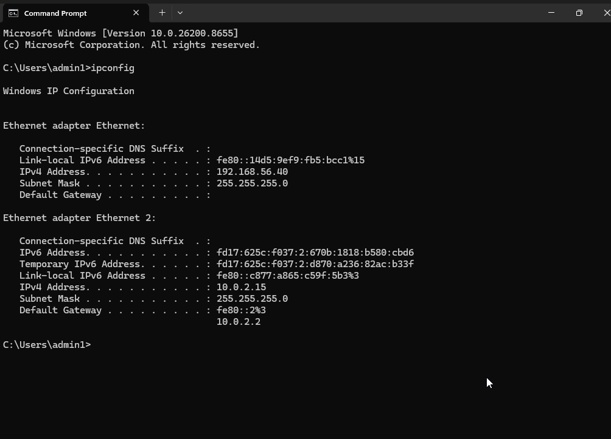
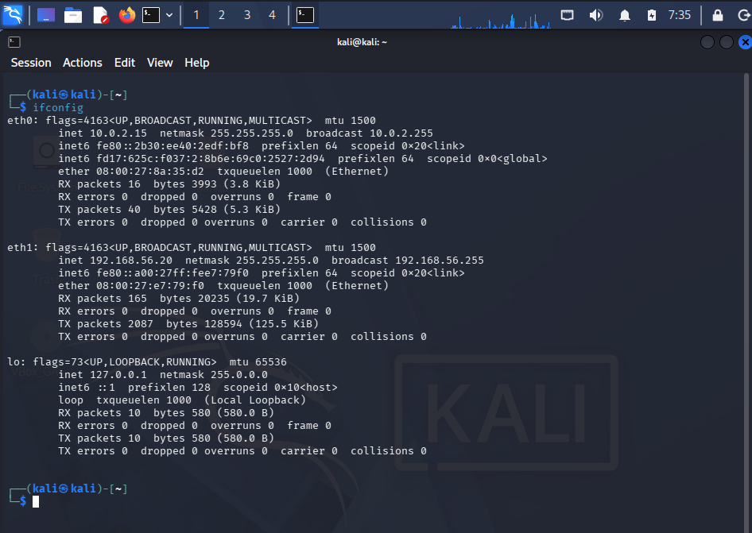
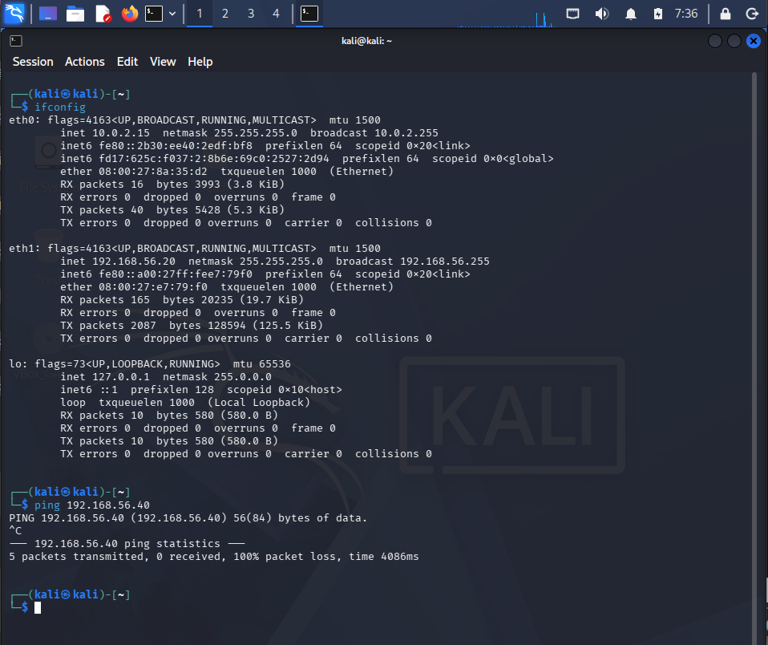
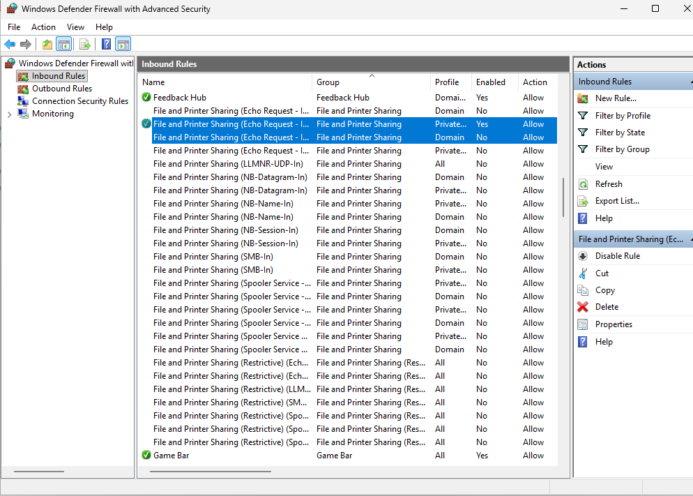
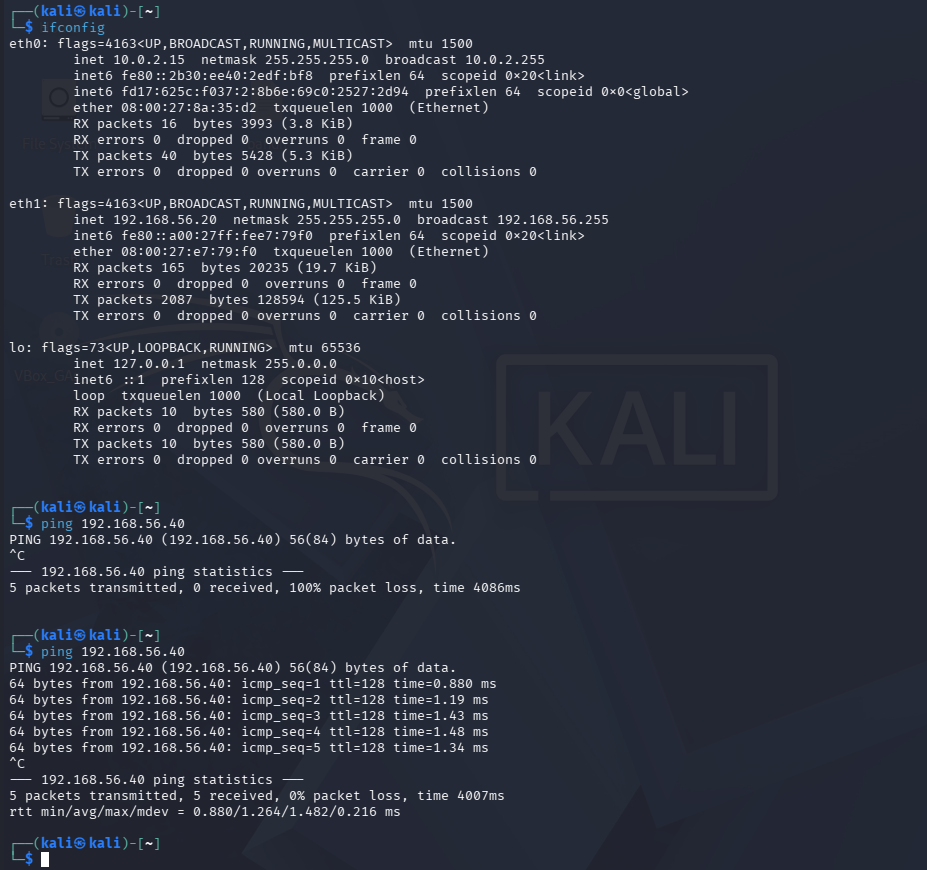
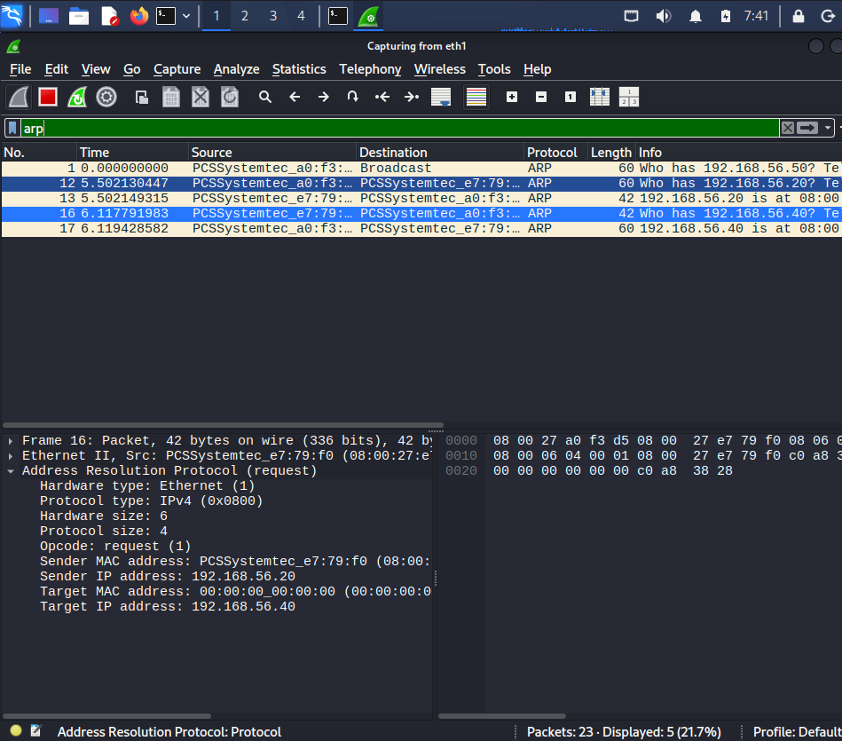
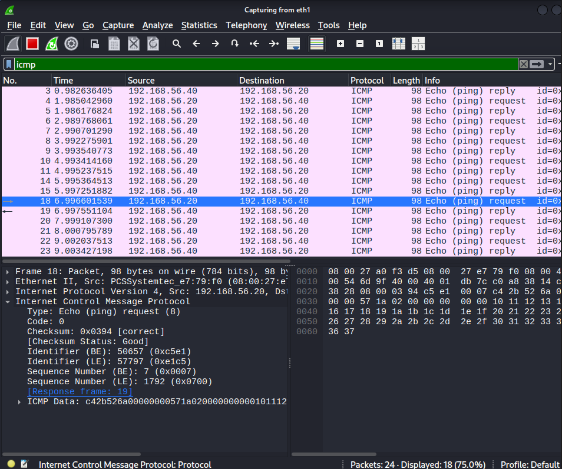
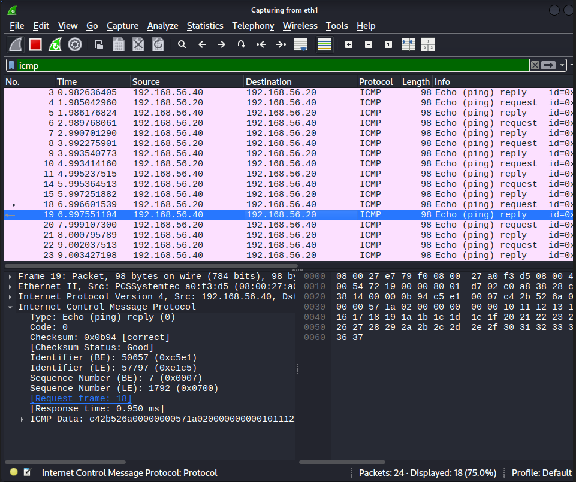

# Lab 01 - Network Connectivity Troubleshooting Using ICMP, ARP, and Windows Firewall

## Scenario

During routine network testing inside my VirtualBox cybersecurity home lab, the Windows 11 endpoint did not respond to ICMP Echo Requests (ping) from the Kali Linux workstation.

The objective of this investigation was to determine whether the issue was caused by a network connectivity problem or a host-based firewall configuration. The troubleshooting process was validated using Wireshark packet analysis.

---

## Objective

- Verify communication between two virtual machines.
- Identify the cause of failed ICMP communication.
- Troubleshoot the issue using a structured investigation process.
- Validate the solution using Wireshark packet captures.
- Document the investigation and findings.

---

## Lab Environment

| Machine | Operating System | IP Address | Role |
|----------|------------------|------------|------|
| Kali Linux | Kali Linux | 192.168.56.20 | Analyst Workstation |
| Windows 11 | Windows 11 | 192.168.56.40 | Target Endpoint |

**Network:** VirtualBox Internal Network

---

## Tools Used

- Kali Linux
- Windows 11
- Wireshark
- Windows Defender Firewall with Advanced Security
- Command Prompt
- Linux Terminal
- VirtualBox

---

# Investigation Workflow

```
Verify IP Configuration
        │
        ▼
Perform ICMP Connectivity Test
        │
        ▼
Ping Failed (100% Packet Loss)
        │
        ▼
Investigate Windows Firewall
        │
        ▼
Enable ICMP Echo Request Rule
        │
        ▼
Repeat Connectivity Test
        │
        ▼
Ping Successful (0% Packet Loss)
        │
        ▼
Capture Traffic with Wireshark
        │
        ▼
Analyze ARP & ICMP Packets
        │
        ▼
Identify Root Cause & Document Findings
```

---

# Investigation Steps

## Step 1 - Verify IP Configuration

Verified the IP configuration of both virtual machines.

### Windows

```cmd
ipconfig
```



### Kali Linux

```bash
ip addr
```



### Observation

- Windows IP Address: **192.168.56.40**
- Kali Linux IP Address: **192.168.56.20**

Both systems were configured within the **192.168.56.0/24** subnet.

---

## Step 2 - Perform Connectivity Test

Executed an ICMP Echo Request from Kali Linux.

```bash
ping 192.168.56.40
```



### Observation

- Packets Sent: **5**
- Packets Received: **0**
- Packet Loss: **100%**

The Windows endpoint did not respond to ICMP Echo Requests.

Possible causes included:

- Incorrect IP configuration
- Network connectivity issue
- Windows Defender Firewall

Further investigation was required.

---

## Step 3 - Investigate Windows Firewall

Opened **Windows Defender Firewall with Advanced Security** and reviewed the inbound firewall rules.

The following rule was identified:

**File and Printer Sharing (Echo Request - ICMPv4-In)**

The rule responsible for responding to ICMP Echo Requests was disabled.



---

## Step 4 - Enable ICMP Echo Request Rule

Enabled the inbound firewall rule and repeated the connectivity test.

```bash
ping 192.168.56.40
```



### Result

- Packets Sent: **5**
- Packets Received: **5**
- Packet Loss: **0%**

Connectivity was successfully restored.

---

## Step 5 - Validate Using Wireshark

Started Wireshark before repeating the connectivity test.

Applied the following display filters.

### ARP

```
arp
```

### ICMP

```
icmp
```

---

# Packet Analysis

## ARP Request



### Observation

Before ICMP communication could begin, Kali Linux first needed to determine the MAC address associated with the Windows endpoint.

The ARP Request asked:

> **Who has 192.168.56.40? Tell 192.168.56.20**

The target MAC address was unknown at the time of transmission, so the request was broadcast across the local network.

---

## ICMP Echo Request



### Observation

After ARP resolution completed, Kali Linux transmitted ICMP Echo Request packets to verify connectivity.

The packet confirmed that communication was successfully initiated from:

- Source: **192.168.56.20**
- Destination: **192.168.56.40**

---

## ICMP Echo Reply



### Observation

The Windows endpoint responded with ICMP Echo Reply packets after the firewall rule was enabled.

This confirmed successful Layer 3 communication between both hosts.

---

# Evidence Collected

| Evidence ID | Evidence | Description |
|------------|----------|-------------|
| E-01 | 01-ipconfig.png | Windows IP configuration |
| E-02 | 02-ipaddr.png | Kali Linux IP configuration |
| E-03 | 03-ping-failed.png | Initial failed connectivity test |
| E-04 | 04-firewall-rule.png | Windows Firewall ICMP rule configuration |
| E-05 | 05-ping-success.png | Successful connectivity after enabling firewall rule |
| E-06 | 06-arp.png | ARP Request packet |
| E-07 | 07-icmp-request.png | ICMP Echo Request packet |
| E-08 | 08-icmp-reply.png | ICMP Echo Reply packet |
| E-09 | network-troubleshooting.pcapng | Complete packet capture |

---

# Analyst Observations

- Both systems were configured on the same subnet.
- IP configuration was verified before troubleshooting.
- Initial ICMP communication failed with 100% packet loss.
- Windows Defender Firewall blocked inbound ICMP Echo Requests.
- Enabling the firewall rule restored communication immediately.
- Wireshark confirmed that ARP resolution occurred before ICMP communication.
- Packet captures validated each stage of the investigation.

---

# Root Cause

The Windows Defender Firewall inbound rule **File and Printer Sharing (Echo Request - ICMPv4-In)** was disabled, preventing the Windows endpoint from responding to ICMP Echo Requests.

---

# Resolution

- Verified IP configuration on both hosts.
- Investigated Windows Defender Firewall.
- Enabled the ICMP Echo Request inbound rule.
- Repeated connectivity testing.
- Validated successful communication using Wireshark packet captures.

---

# Skills Demonstrated

- Network Troubleshooting
- Wireshark Packet Analysis
- Windows Defender Firewall Analysis
- ICMP Analysis
- ARP Analysis
- Root Cause Analysis
- Evidence Collection
- Technical Documentation

---

# Lessons Learned

- A failed ping does not always indicate that a host is offline.
- Host-based firewalls can block ICMP while allowing other protocols.
- ARP resolution occurs before communication between hosts on the same local network.
- Packet captures provide evidence that supports troubleshooting decisions.
- A structured investigation process improves accuracy and reduces assumptions.

---

# Interview Questions

1. Why does ARP occur before ICMP communication?
2. Why was the Target MAC address unknown during the ARP Request?
3. Can a failed ping always indicate that a host is offline? Why or why not?
4. How did Wireshark help validate the troubleshooting process?
5. Why did enabling the Windows Firewall rule resolve the issue?

---

# Conclusion

This investigation demonstrated a structured approach to network troubleshooting using command-line diagnostics, Windows Defender Firewall analysis, and Wireshark packet captures.

The root cause was identified as a disabled Windows Defender Firewall rule rather than a network connectivity issue. Evidence collected throughout the investigation confirmed successful ARP resolution followed by ICMP communication after remediation.

This lab reinforced the importance of evidence-based troubleshooting and demonstrated how packet analysis can be used to validate findings during cybersecurity investigations.
