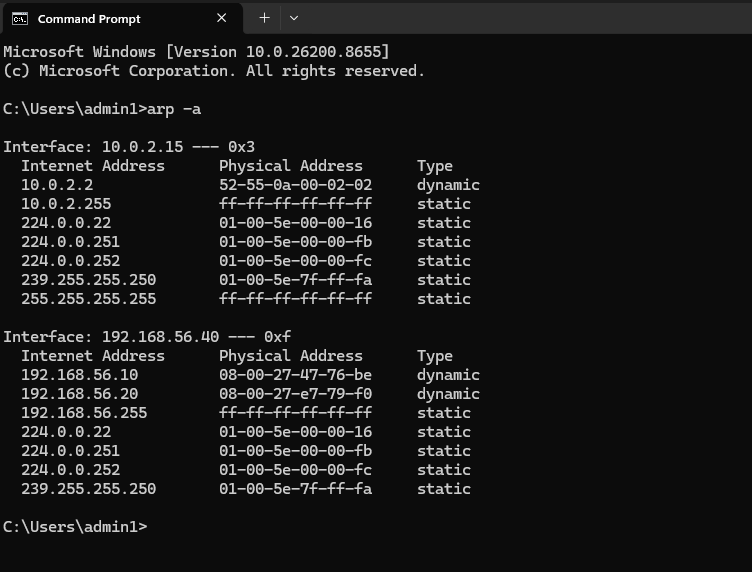
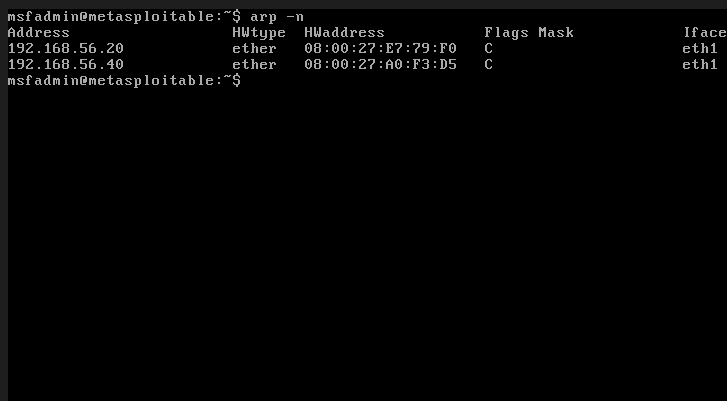
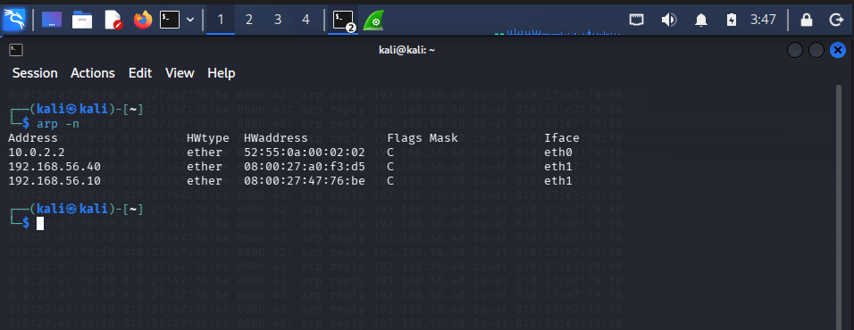
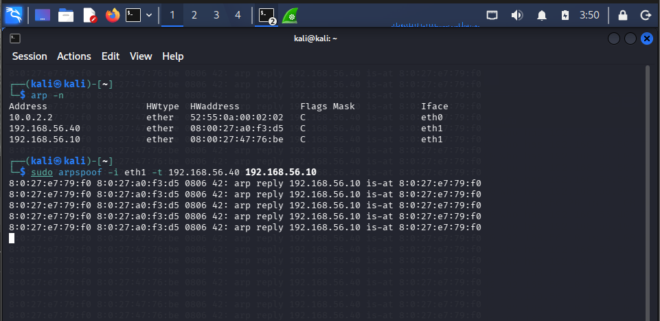
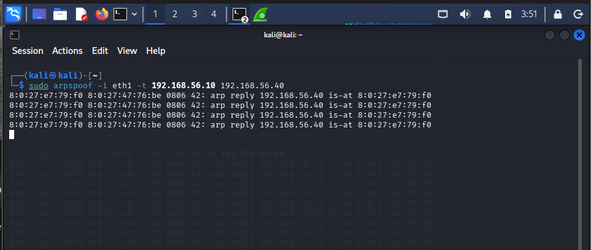
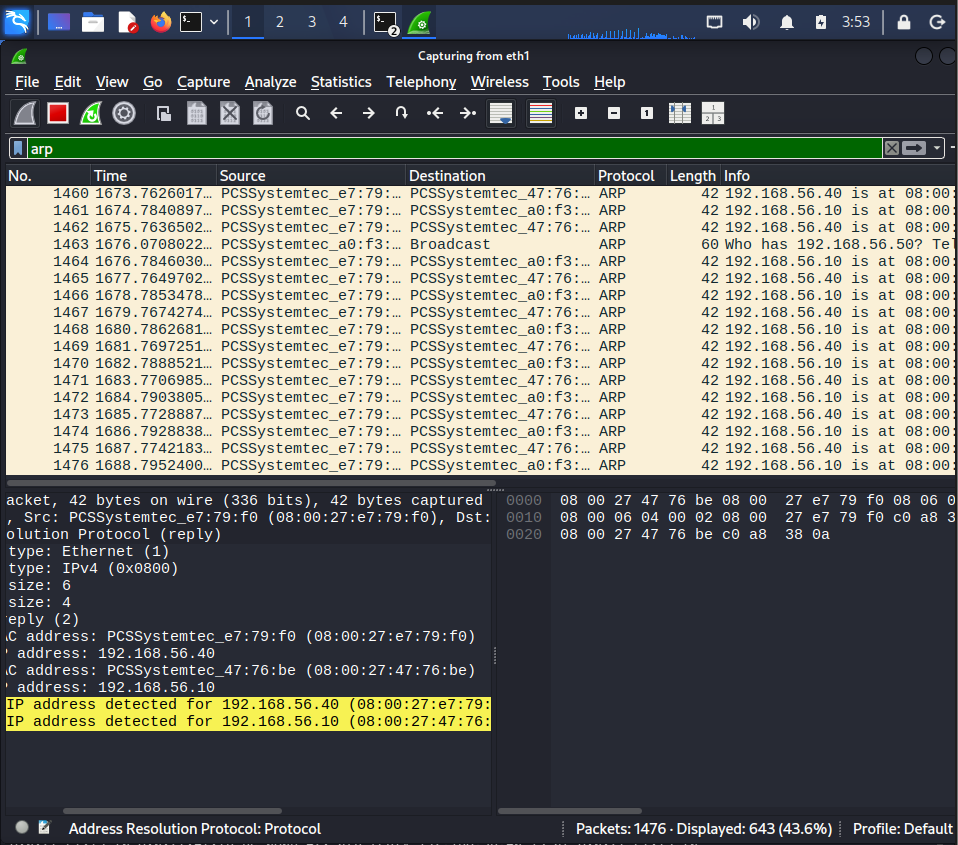
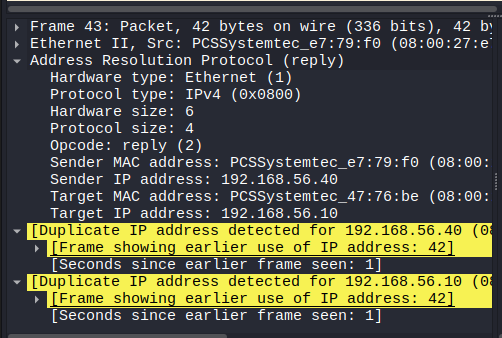
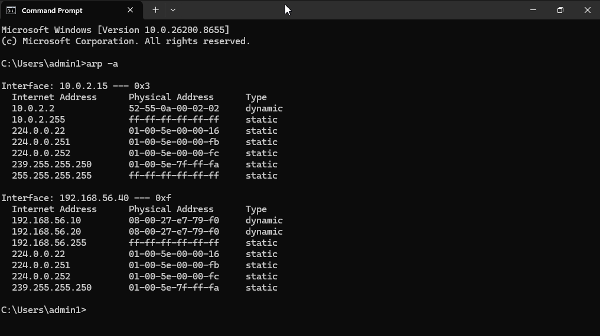
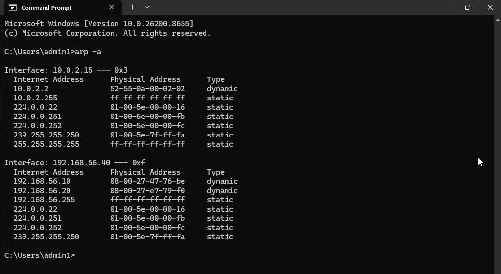

# Lab 02 – ARP Spoofing Investigation (Man-in-the-Middle)

## Executive Summary

This investigation demonstrates how an ARP Spoofing attack can manipulate a victim's ARP cache and redirect network traffic through an attacker's system. Using my isolated cybersecurity home lab, I established a normal network baseline, executed a controlled ARP Spoofing attack, captured the malicious traffic using Wireshark, analyzed the impact on the victim's ARP cache, and verified successful recovery after stopping the attack.

---

# Scenario

During a network investigation, suspicious ARP traffic was detected between hosts on the local network. The objective was to determine whether an attacker was performing an ARP Spoofing attack, analyze its impact, and validate system recovery.

---

# Objectives

- Understand normal ARP communication
- Investigate ARP cache behavior
- Perform an ARP Spoofing attack in a controlled lab
- Capture malicious ARP traffic using Wireshark
- Analyze changes in the victim's ARP cache
- Verify recovery after the attack
- Document the investigation

---

# Lab Environment

| Machine | Role | IP Address |
|---------|------|------------|
| Kali Linux | Attacker | 192.168.56.20 |
| Windows 11 | Victim | 192.168.56.40 |
| Metasploitable 2 | Target | 192.168.56.10 |

### Tools Used

- Kali Linux
- Windows 11
- Metasploitable 2
- Wireshark
- arpspoof (dsniff)
- VirtualBox Internal Network

---

# Investigation Workflow

```text
Establish Baseline
        ↓
Verify Communication
        ↓
Enable IP Forwarding
        ↓
Launch ARP Spoofing
        ↓
Capture Network Traffic
        ↓
Analyze ARP Cache
        ↓
Verify Recovery
```

---

# Attack Commands

## Enable IP Forwarding

```bash
sudo sysctl -w net.ipv4.ip_forward=1
```

## Poison Windows ARP Cache

```bash
sudo arpspoof -i eth1 -t 192.168.56.40 192.168.56.10
```

## Poison Metasploitable ARP Cache

```bash
sudo arpspoof -i eth1 -t 192.168.56.10 192.168.56.40
```

---

# Investigation

## Phase 1 – Baseline

Before launching the attack, the ARP tables on Windows, Kali Linux, and Metasploitable contained legitimate IP-to-MAC mappings.

### Evidence

### Windows ARP Cache



### Metasploitable ARP Cache



### Kali ARP Cache



---

## Phase 2 – Attack Execution

The attacker continuously transmitted forged ARP Reply packets to both Windows and Metasploitable, poisoning their ARP caches.

### Evidence

#### ARP Spoof Command (Windows Target)



#### ARP Spoof Command (Metasploitable Target)



---

## Phase 3 – Packet Analysis

Wireshark captured repeated forged ARP Reply packets generated by the attacker.

During the attack, Wireshark also detected duplicate IP address warnings, indicating conflicting IP-to-MAC advertisements on the network.

### Evidence

#### Repeated ARP Replies



#### Duplicate IP Warning



---

## Phase 4 – ARP Cache Poisoning

During the attack, the Windows ARP cache incorrectly mapped the IP address of the Metasploitable system to the attacker's MAC address.

As a result, traffic intended for the target system was redirected to Kali Linux.

### Evidence



---

## Phase 5 – Recovery

After stopping the ARP Spoofing attack, clearing the ARP cache, and generating new traffic, Windows relearned the legitimate MAC address and normal communication was restored.

### Evidence



---

# Indicators of Compromise (IoCs)

- Repeated unsolicited ARP Reply packets
- Duplicate IP address warnings
- Incorrect IP-to-MAC mappings
- Multiple IP addresses resolving to the same MAC address
- Continuous ARP Reply traffic

---

# Root Cause Analysis

ARP does not authenticate ARP Reply packets.

The attacker exploited this weakness by sending forged ARP Replies, causing the victim to replace legitimate IP-to-MAC mappings with the attacker's MAC address.

This redirected network traffic through the attacker's system, enabling a Man-in-the-Middle (MITM) attack.

---

# Recovery Actions

- Stopped the ARP Spoofing attack
- Cleared the Windows ARP cache
- Generated new network traffic
- Verified restoration of legitimate ARP entries

---

# Skills Practiced

- ARP Protocol Analysis
- ARP Cache Investigation
- Wireshark Packet Analysis
- ARP Spoofing
- Man-in-the-Middle (MITM)
- Network Troubleshooting
- Incident Investigation
- Evidence Collection
- Root Cause Analysis

---

# MITRE ATT&CK

| Tactic | Technique |
|---------|-----------|
| Credential Access | T1557 – Adversary-in-the-Middle |

---

# Evidence

The complete packet capture used during this investigation is available in the **evidence** folder.

```text
evidence/
└── arp-spoofing.pcapng
```

---

# Key Takeaways

- ARP operates without authentication.
- ARP Spoofing manipulates IP-to-MAC mappings.
- Wireshark can identify duplicate IP warnings and suspicious ARP activity.
- ARP cache poisoning can redirect traffic through an attacker.
- Clearing the ARP cache restores legitimate communication after the attack ends.

---

# Lessons Learned

- Established a normal network baseline before performing the attack.
- Verified ARP cache changes before, during, and after the attack.
- Observed repeated forged ARP Reply packets using Wireshark.
- Understood the importance of IP forwarding during a MITM attack.
- Successfully restored the network to a normal state after the investigation.

---

# Interview Questions

1. What is ARP Spoofing?
2. Why is ARP vulnerable to spoofing?
3. How does ARP Spoofing enable a Man-in-the-Middle attack?
4. What indicators suggest an ARP Spoofing attack?
5. Why was IP forwarding enabled on the attacker's system?
6. How can organizations detect and mitigate ARP Spoofing?
7. What changes occurred in the victim's ARP cache during the attack?

---

## Author

**Dinesh Babu**

Cybersecurity Home Lab Series
