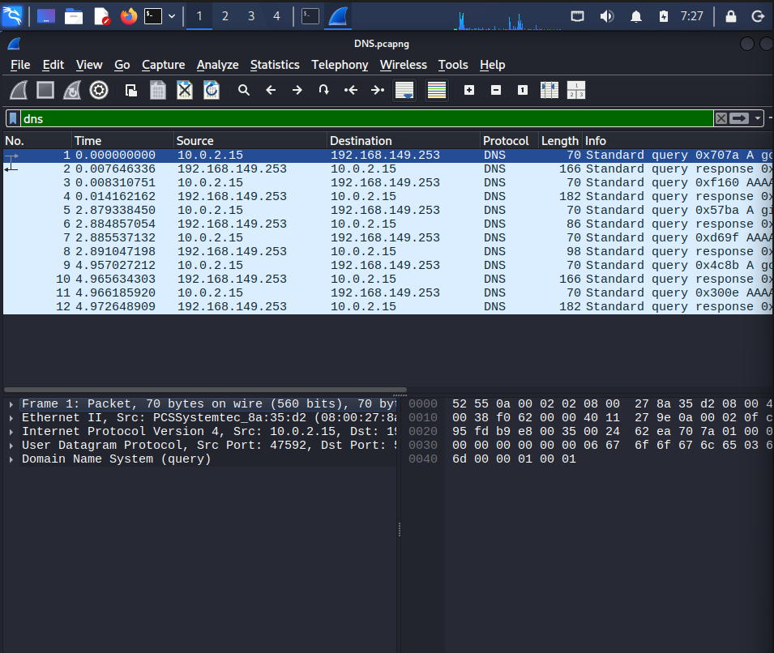
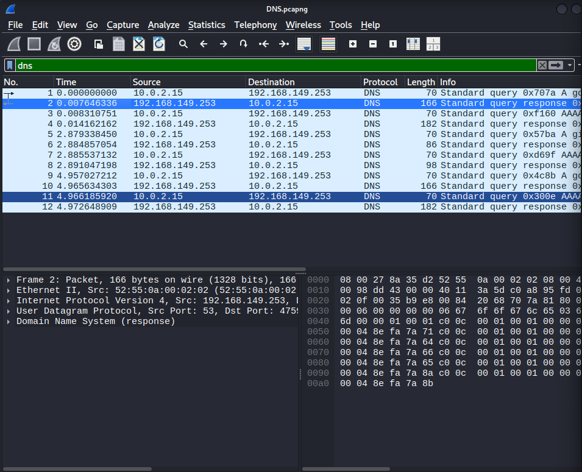
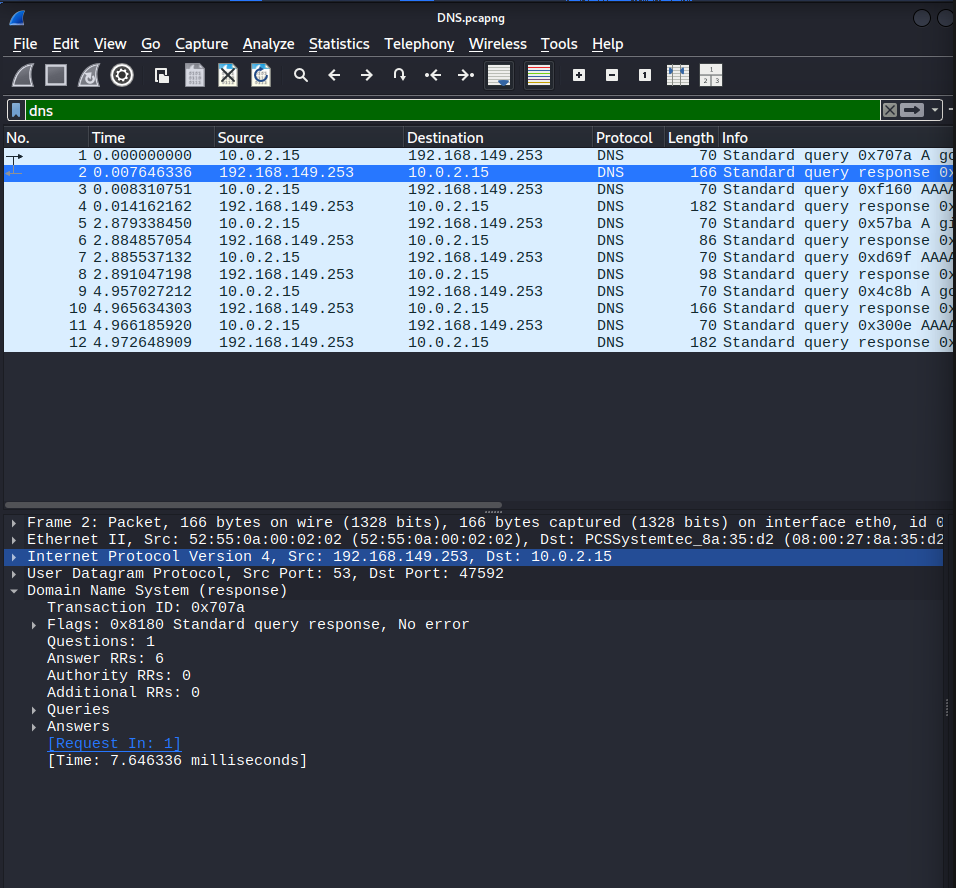

# DNS Investigation Using Wireshark

## Objective

Capture and analyze DNS traffic using Wireshark to understand how domain names are translated into IP addresses. This investigation focuses on examining DNS queries and responses, identifying key protocol fields, and understanding the role of DNS in network communication.

---

# Lab Environment

| Machine | Role | IP Address |
|----------|------|------------|
| Kali Linux | Client / Analyst | 10.0.2.15 |
| DNS Server | Name Resolution Server | 192.168.149.253 |

---

# Tools Used

- Wireshark
- Kali Linux
- Firefox Web Browser
- VirtualBox

---

# Protocols Analyzed

- DNS (Domain Name System)
- UDP
- IPv4
- Ethernet II

---

# Investigation Scenario

A client attempted to access **google.com**. Before communication with the web server could begin, the client needed to resolve the domain name into an IP address.

The objective of this investigation was to capture and analyze the DNS query and response packets to understand how DNS resolution works.

---

# Investigation Process

## Step 1 – Generate DNS Traffic

DNS traffic was generated by opening **google.com** in Firefox.

### Screenshot



---

## Step 2 – Analyze the DNS Query

The DNS query packet was examined to identify the information sent by the client.

### Key Observations

- Source IP: **10.0.2.15**
- Destination IP: **192.168.149.253**
- Source Port: **47592**
- Destination Port: **53**
- Transaction ID: **0x707a**
- Query Type: **A Record**
- Requested Domain: **google.com**

DNS uses **UDP Port 53** for most queries because it provides fast, low-overhead communication.

---

## Step 3 – Analyze the DNS Response

The DNS server responded successfully with multiple IPv4 addresses for the requested domain.

### Screenshot



### Key Observations

- Transaction ID matched the query.
- Response Code: **No Error**
- Question Count: **1**
- Answer Records: **6**
- Multiple IPv4 addresses were returned.

---

## Step 4 – Inspect DNS Packet Details

The DNS protocol fields were expanded to analyze the response in greater detail.

### Screenshot



### Fields Analyzed

- Transaction ID
- Flags
- Questions
- Answer Records
- TTL
- IPv4 Addresses

---

# Investigation Findings

- DNS communication successfully used **UDP Port 53**.
- The Transaction ID matched between the query and response packets.
- The DNS server successfully resolved **google.com**.
- Six IPv4 addresses were returned as **A Records**.
- The **No Error** response confirmed successful name resolution.
- DNS TTL indicates how long the DNS response can be cached before another lookup is required.

---

# Evidence

The original packet capture used during this investigation is available in the **Evidence** folder.

```text
Evidence/
└── DNS.pcapng
```

---

# Skills Practiced

- DNS Traffic Analysis
- Wireshark Packet Analysis
- UDP Protocol Analysis
- Network Traffic Investigation
- DNS Query Analysis
- DNS Response Analysis
- Packet Inspection
- Network Troubleshooting

---

# Key Learnings

- DNS translates domain names into IP addresses.
- DNS queries and responses are linked using the Transaction ID.
- DNS primarily uses UDP because it is fast and efficient.
- DNS responses may contain multiple A records for load balancing and high availability.
- DNS TTL controls how long a DNS response remains in cache before another lookup is required.
- Packet-level analysis helps security analysts understand normal network behavior and identify suspicious DNS activity.

---

# Conclusion

This investigation provided hands-on experience analyzing DNS traffic using Wireshark. By examining both DNS query and response packets, I gained a deeper understanding of the DNS resolution process, packet structure, and protocol behavior.

Understanding DNS traffic is an essential skill for SOC analysts because DNS is frequently involved in phishing, malware communications, command-and-control (C2) activity, and threat investigations.
