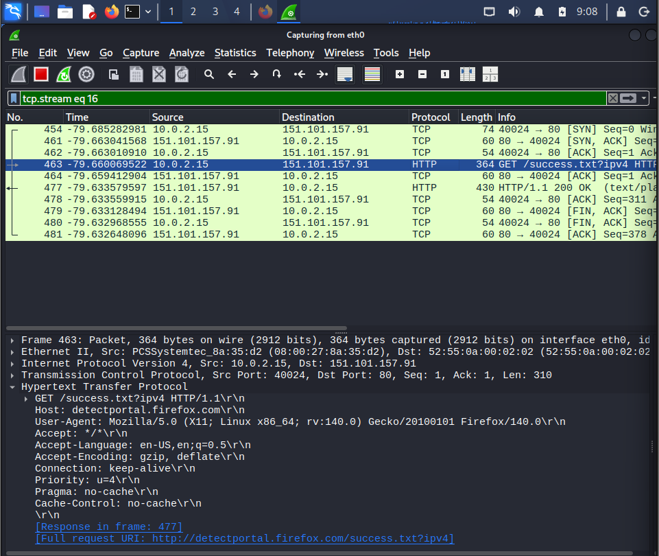
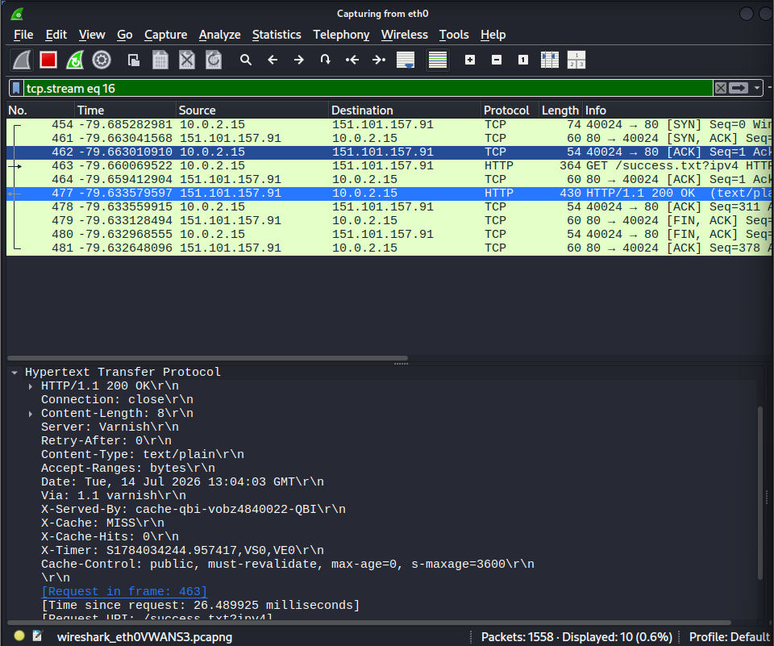
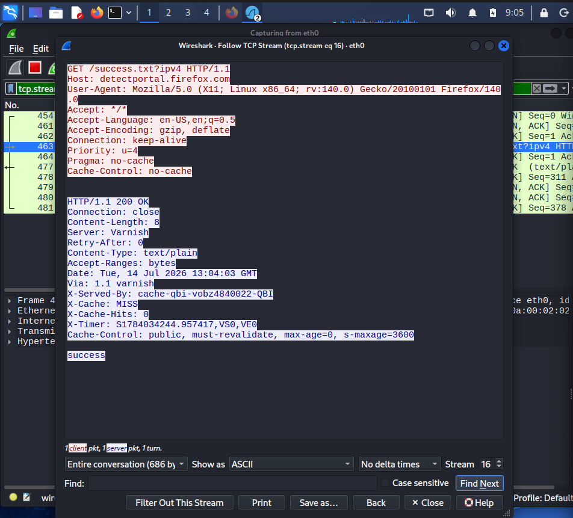
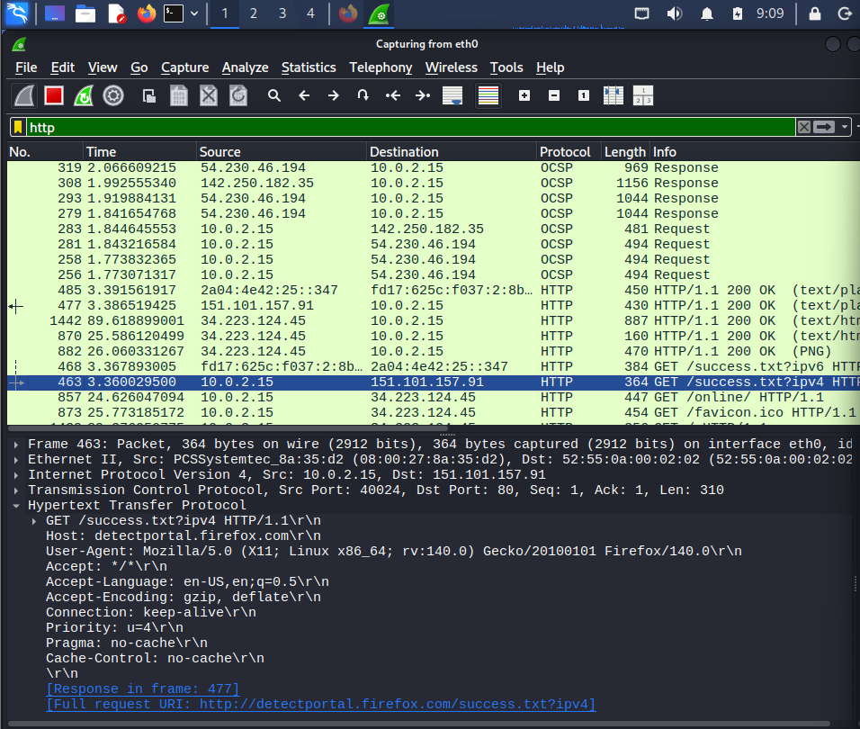

# HTTP Traffic Investigation

## Objective

Captured and analyzed HTTP traffic using Wireshark to understand how web browsers communicate with web servers. Investigated HTTP requests, responses, headers, and TCP stream reconstruction inside a controlled lab environment.

---

# Lab Environment

| Machine | Role | IP Address |
|----------|------|------------|
| Kali Linux | Traffic Analyst | 10.0.2.15 |
| Firefox Browser | HTTP Client | 10.0.2.15 |
| detectportal.firefox.com | Web Server | 151.101.157.91 |

---

# Tools Used

- Wireshark
- Kali Linux
- Firefox Browser

---

# Protocols Analyzed

- HTTP
- TCP

---

# Scenario

Captured HTTP traffic generated by accessing a test webpage over HTTP. The investigation focused on identifying the HTTP request, server response, headers, and complete TCP conversation.

---

# Investigation Steps

## Step 1 – Generate HTTP Traffic

Visited:

```
http://detectportal.firefox.com/success.txt?ipv4
```

Captured packets using Wireshark.

---

## Step 2 – Apply HTTP Filter

Applied the display filter:

```wireshark
http
```

to isolate HTTP packets from the capture.

---

## Step 3 – Analyze HTTP GET Request

Investigated the client request and identified:

- HTTP Method: GET
- Request URI: /success.txt?ipv4
- HTTP Version: HTTP/1.1
- Host: detectportal.firefox.com
- User-Agent: Mozilla Firefox
- Destination Port: TCP/80

---

## Step 4 – Analyze HTTP Response

Examined the server response and identified:

- Status Code: 200 OK
- Content-Type: text/plain
- Content-Length: 8 bytes
- Server: Varnish

---

## Step 5 – Follow TCP Stream

Used **Follow → TCP Stream** to reconstruct the complete HTTP conversation between the client and server.

This revealed:

- Complete HTTP request
- Complete HTTP response
- Returned content (`success`)

---

# Findings

- Successfully identified the HTTP GET request.
- Verified communication over TCP port 80.
- Observed an HTTP 200 OK response from the web server.
- Examined HTTP request and response headers.
- Reconstructed the full client-server communication using TCP Stream.

---

# SOC Investigation Notes

From a SOC analyst's perspective, HTTP traffic provides valuable information because it is transmitted in plaintext.

During this investigation, it was possible to observe:

- Requested URLs
- Host information
- User-Agent
- Server software
- Response status codes
- Response content
- Content type
- Content length

Such information can help analysts detect suspicious browsing activity, malicious downloads, unauthorized communications, and web-based attacks.

---

# Evidence

HTTP Packet Capture

- `Evidence/HTTP.pcapng`

---

# Screenshots

## HTTP GET Request



---

## HTTP 200 OK Response



---

## Follow TCP Stream



---

## HTTP Packet Overview



---

# Skills Practiced

- HTTP packet analysis
- TCP stream reconstruction
- HTTP header analysis
- Web traffic investigation
- Packet filtering
- Network troubleshooting
- Wireshark protocol analysis
- SOC investigation techniques

---

# Key Learnings

- Understood how HTTP communication works.
- Learned the structure of HTTP requests and responses.
- Investigated common HTTP headers.
- Practiced reconstructing HTTP conversations.
- Improved practical packet analysis skills using Wireshark.
- Developed a SOC analyst approach for investigating web traffic.
