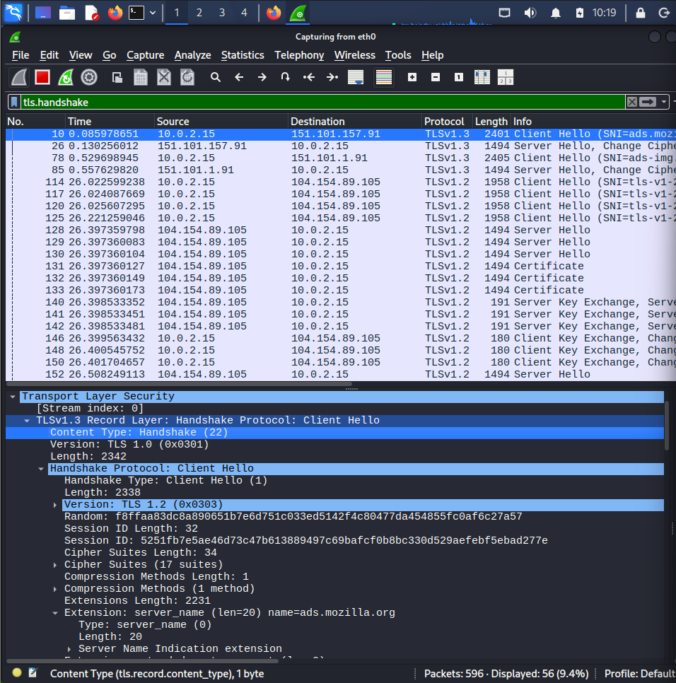
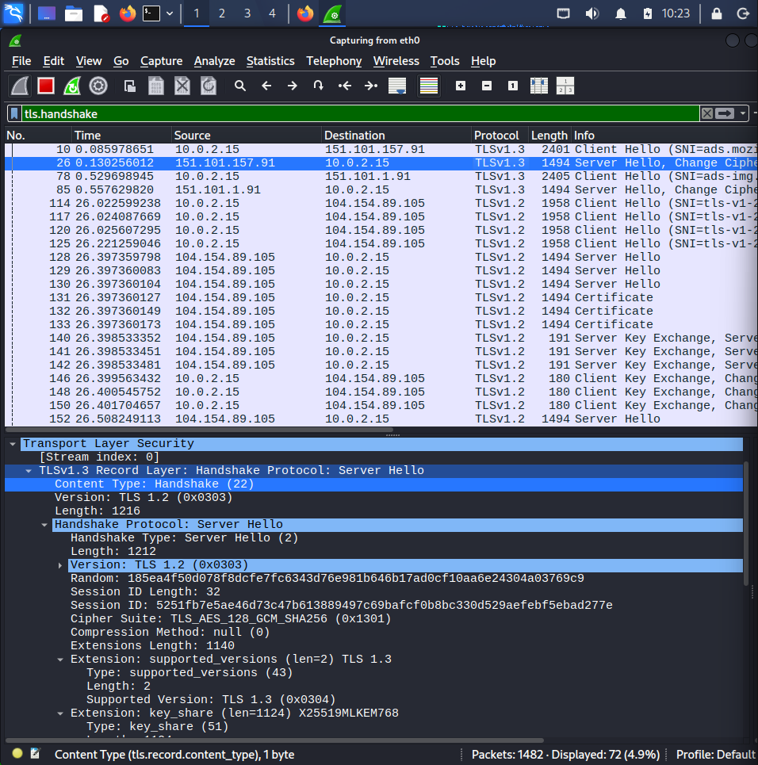
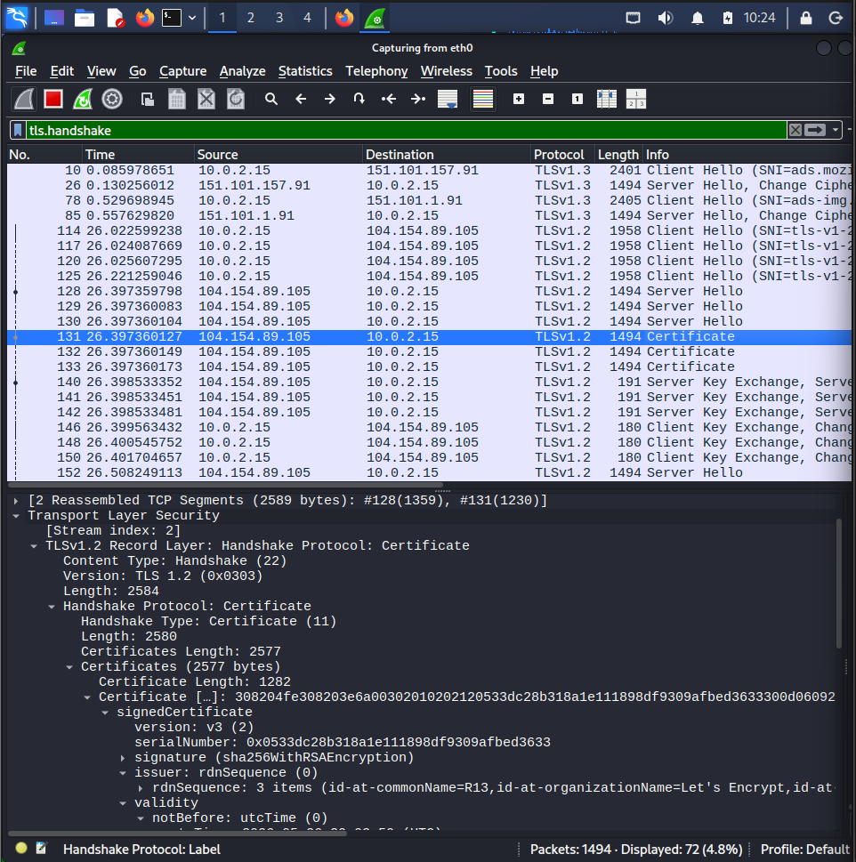
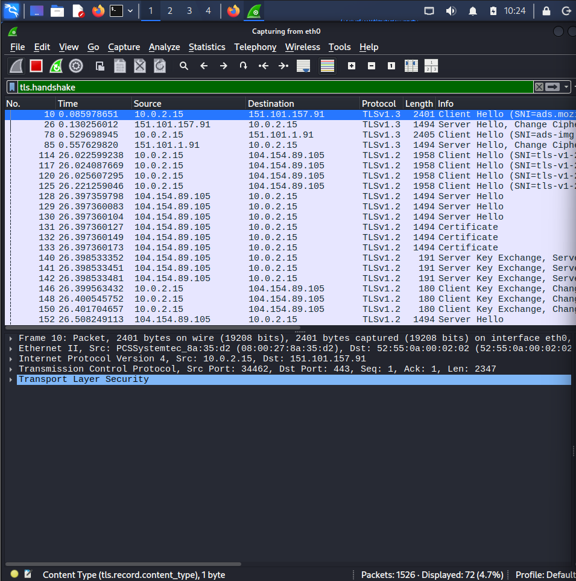

# HTTPS Traffic Analysis using Wireshark

## Overview

This investigation demonstrates how HTTPS traffic can be analyzed in Wireshark to understand the TLS handshake process. Although HTTPS encrypts application data, the handshake reveals valuable metadata such as supported TLS versions, cipher suites, Server Name Indication (SNI), and certificate information.

This lab highlights how security analysts can validate encrypted connections and identify useful indicators without decrypting the traffic.

---

## Objective

- Capture HTTPS traffic using Wireshark
- Analyze the TLS handshake
- Identify Client Hello and Server Hello messages
- Examine the server certificate
- Understand why HTTPS provides confidentiality and integrity
- Compare encrypted HTTPS traffic with plain HTTP traffic

---

## Lab Environment

| Component | Details |
|-----------|---------|
| Operating System | Kali Linux |
| Tool | Wireshark |
| Protocol | HTTPS (TLS 1.3) |
| Interface | eth0 |
| Browser | Mozilla Firefox |

---

# Investigation Steps

## Step 1 – Capture HTTPS Traffic

Started packet capture on **eth0** and visited an HTTPS website using Firefox.

Applied the following display filter:

```text
tls.handshake
```

This isolates TLS handshake packets from the capture.

---

## Step 2 – Analyze Client Hello

The Client Hello packet contains information about the client's supported TLS capabilities.

### Observations

- Source IP: **10.0.2.15**
- Destination IP: **151.101.157.91**
- TLS Version Offered: **TLS 1.2 (for compatibility)**
- Negotiated Protocol: **TLS 1.3**
- Server Name Indication (SNI): **ads.mozilla.org**
- Cipher Suites Offered: **17**

This packet initiates the secure connection.

---

## Step 3 – Analyze Server Hello

The server selects the encryption parameters that will be used.

### Observations

- Negotiated TLS Version: **TLS 1.3**
- Selected Cipher Suite:

```text
TLS_AES_128_GCM_SHA256
```

The Server Hello confirms the secure communication parameters.

---

## Step 4 – Inspect the Certificate

The Certificate message allows the client to verify the server's identity.

### Observations

- Certificate Version: **v3**
- Signature Algorithm:

```text
sha256WithRSAEncryption
```

- Certificate Issuer

```text
Let's Encrypt
```

- Certificate Validity

- Not Before:
  - 2026-05-26

- Not After:
  - 2026-08-24

The certificate is digitally signed by a trusted Certificate Authority (CA), enabling browsers to verify the authenticity of the website.

---

# SOC Analyst Observations

During HTTPS investigations, analysts cannot view the application data because it is encrypted.

However, useful metadata is still visible, including:

- Source and destination IP addresses
- TLS version
- Cipher suite
- Server Name Indication (SNI)
- Certificate information
- Certificate validity period
- Certificate issuer
- Handshake sequence

This information is useful when investigating:

- Suspicious encrypted connections
- Malicious domains
- Expired certificates
- Fake certificates
- TLS downgrade attempts
- Command-and-Control (C2) traffic

---

# Why HTTPS is Secure

Unlike HTTP, HTTPS encrypts the application payload using TLS.

As a result:

- Login credentials cannot be viewed.
- Cookies are protected.
- Webpage contents remain encrypted.
- Sensitive information cannot be read by attackers monitoring the network.

Only metadata from the TLS handshake remains visible.

---

# Evidence

- HTTPS.pcapng

- `Evidence/HTTPS.pcapng`

# Screenshots

### Client Hello



---

### Server Hello



---

### Certificate Details



---

### TLS Handshake Overview



---

# Skills Demonstrated

- Wireshark packet analysis
- TLS handshake analysis
- HTTPS traffic inspection
- Certificate validation
- Cipher suite identification
- TLS version analysis
- Network protocol analysis
- SOC investigation methodology

---

# Tools Used

- Wireshark
- Mozilla Firefox
- Kali Linux

---

## Key Learning

This investigation demonstrates that although HTTPS encrypts user data, Wireshark still exposes valuable TLS metadata that security analysts can use to investigate encrypted communications, validate certificates, identify suspicious connections, and understand secure web traffic without decrypting the payload.
