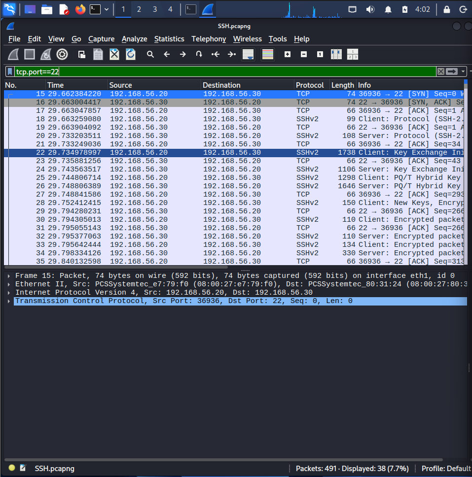
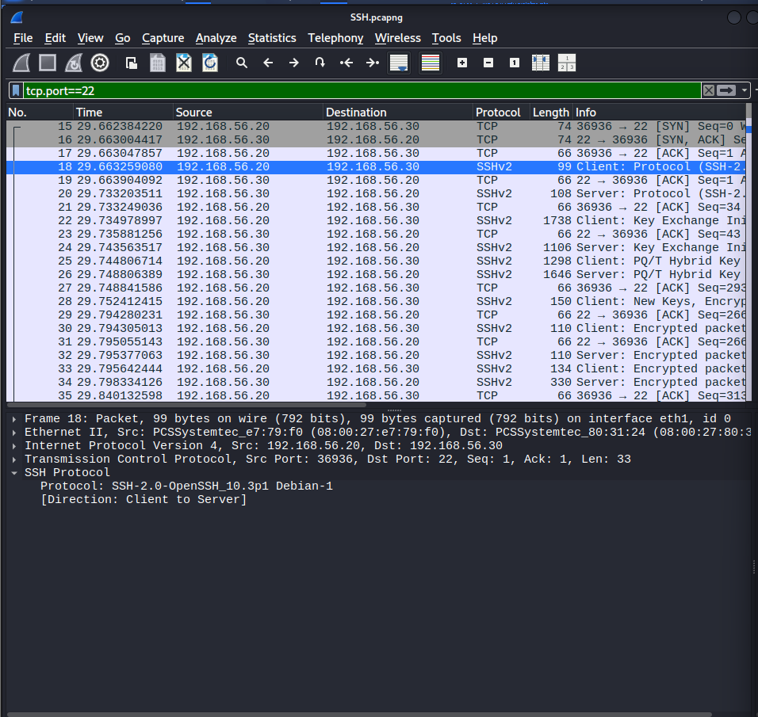
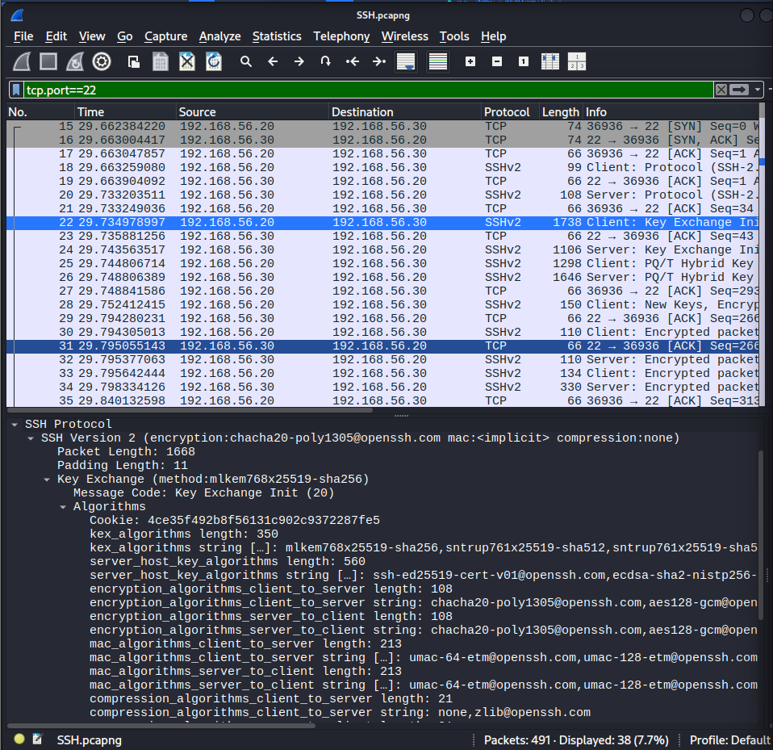
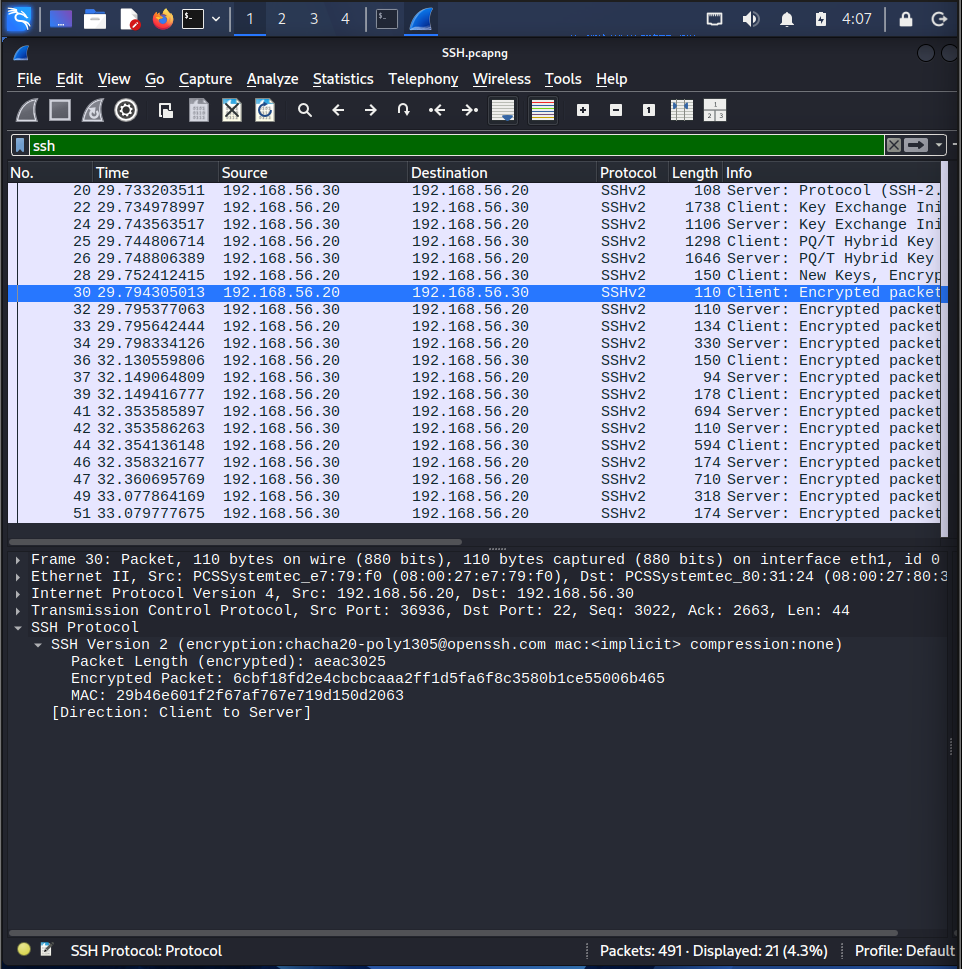
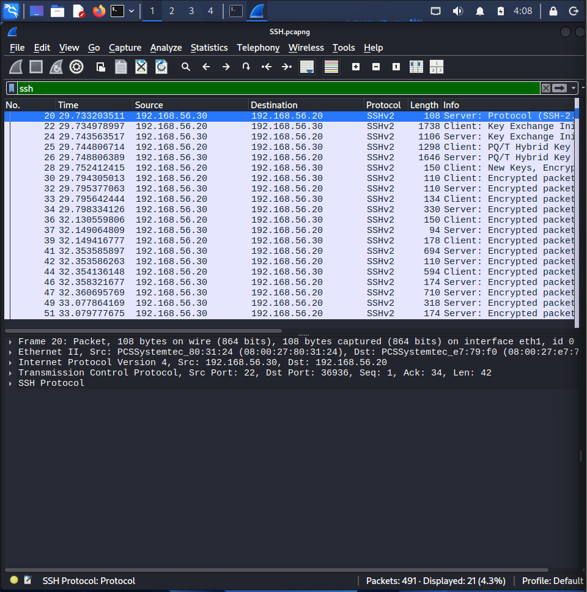

# Lab 07 – SSH Traffic Investigation

## Objective

The objective of this lab is to analyze the Secure Shell (SSH) protocol using Wireshark. The investigation focuses on the TCP three-way handshake, SSH version exchange, key exchange process, and encrypted communication between a Kali Linux client and an Ubuntu SSH server.

---

## Lab Environment

| Machine | Role |
|----------|------|
| Kali Linux | SSH Client |
| Ubuntu | SSH Server |
| Wireshark | Network Packet Analyzer |

---

## Tools Used

- Wireshark
- Kali Linux
- Ubuntu
- OpenSSH

---

## Protocol Overview

SSH (Secure Shell) is a secure remote administration protocol that provides encrypted communication between a client and a server. Unlike Telnet, SSH encrypts authentication credentials and all session data, protecting against eavesdropping and man-in-the-middle attacks.

Default Port: **TCP 22**

---

## Investigation Steps

### 1. Captured SSH Traffic

A packet capture was started on the internal network interface while an SSH connection was established from the Kali Linux machine to the Ubuntu server.

---

### 2. TCP Three-Way Handshake

The investigation confirmed the successful TCP connection before the SSH session began.

Observed sequence:

- SYN
- SYN, ACK
- ACK

---

### 3. SSH Version Exchange

The client and server exchanged protocol information to identify the supported SSH version and software implementation.

Observed:

- SSH Protocol Version: SSH-2.0
- OpenSSH Client
- OpenSSH Server

No outdated protocol versions were observed.

---

### 4. SSH Key Exchange

The SSH client and server negotiated cryptographic algorithms used to secure the session.

Observed negotiation included:

- Key Exchange Algorithm
- Host Key Algorithm
- Encryption Algorithm
- MAC Algorithm
- Compression Algorithm

These algorithms were exchanged before any authentication occurred.

---

### 5. Encrypted Session

After the key exchange completed, the session became encrypted.

The investigation confirmed that:

- User credentials were not visible.
- Executed commands were not visible.
- Only packet metadata remained observable.

---

## Findings

- Successful SSH connection established.
- SSH Version 2 used.
- Secure key exchange completed successfully.
- Session encrypted after key negotiation.
- Commands and passwords protected from packet inspection.

---

## Security Observation

Although the SSH payload is encrypted, a network analyst can still observe:

- Source IP Address
- Destination IP Address
- Source Port
- Destination Port
- Packet Size
- Packet Timing
- Connection Duration
- SSH Version Information

This metadata is valuable during incident investigations and threat hunting.

---

## Evidence

### Packet Capture

- `Evidence/SSH.pcapng`

### Screenshots

#### TCP Three-Way Handshake

---

#### SSH Version Exchange

---

#### SSH Key Exchange

---

#### Encrypted SSH Session

---

#### SSH Traffic Overview

---

## Conclusion

This investigation demonstrated how SSH establishes a secure communication channel through TCP connection establishment, protocol negotiation, cryptographic key exchange, and encrypted data transmission. While the payload remains encrypted, packet metadata and protocol negotiation details continue to provide valuable information for network monitoring and SOC investigations.