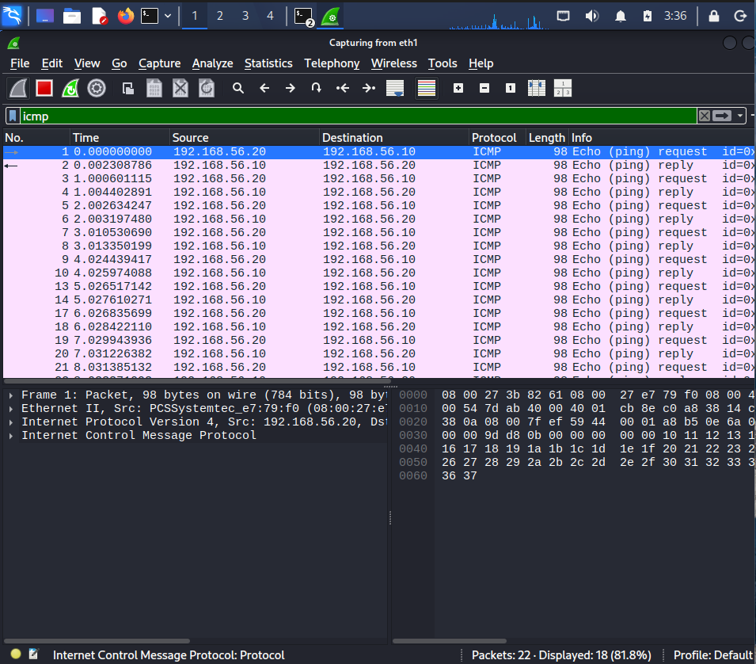
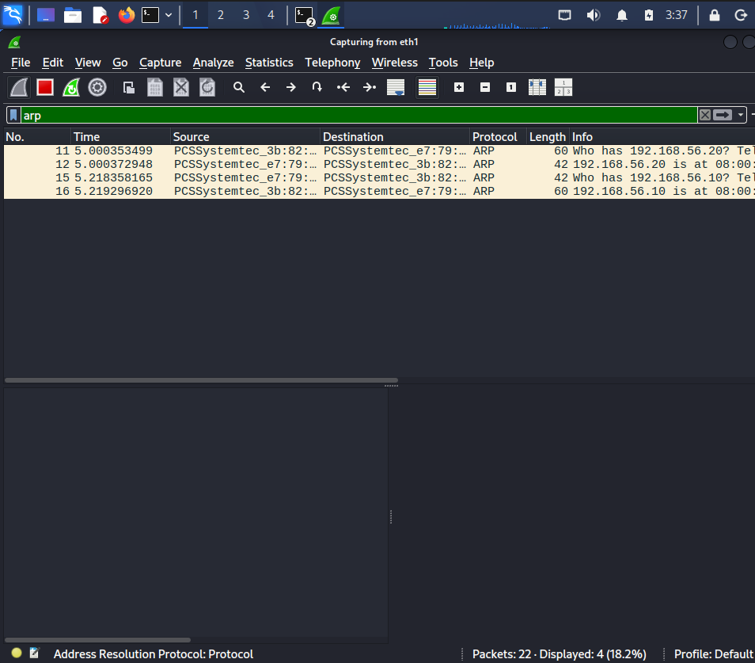
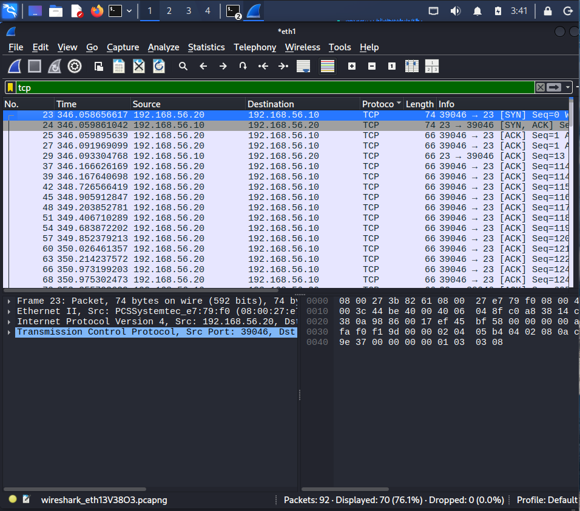

# Wireshark Traffic Analysis

## Objective

Captured and analyzed network traffic inside an isolated cybersecurity home lab using Wireshark.

---

# Lab Environment

| Machine | Role | IP Address |
|---|---|---|
| Kali Linux | Attacker/Analyst | 192.168.56.20 |
| Metasploitable 2 | Target Machine | 192.168.56.10 |

---

# Tools Used

- Wireshark
- Kali Linux
- Metasploitable 2
- VirtualBox Internal Network

---

# Protocols Analyzed

- ICMP
- ARP
- TCP

---

# ICMP Traffic Analysis

Generated ICMP traffic using ping commands and analyzed request/reply packets in Wireshark.

Command Used:

```bash
ping 192.168.56.10
```

---

# ARP Traffic Analysis

Observed ARP requests and replies used for MAC address resolution inside the local network.

---

# TCP Handshake Analysis

Analyzed TCP SYN, SYN-ACK, and ACK packets during TCP communication.

---

# Skills Practiced

- Packet capture analysis
- Protocol filtering
- Traffic investigation
- Network troubleshooting
- Protocol understanding
- SOC analyst fundamentals

---

# Screenshots

## ICMP Packet Capture



---

## ARP Traffic Analysis



---

## TCP Handshake Analysis


---

# Key Learnings

- Understood how ICMP communication works
- Learned ARP request/reply behavior
- Observed TCP three-way handshake
- Practiced packet filtering in Wireshark
- Improved network traffic analysis skills
